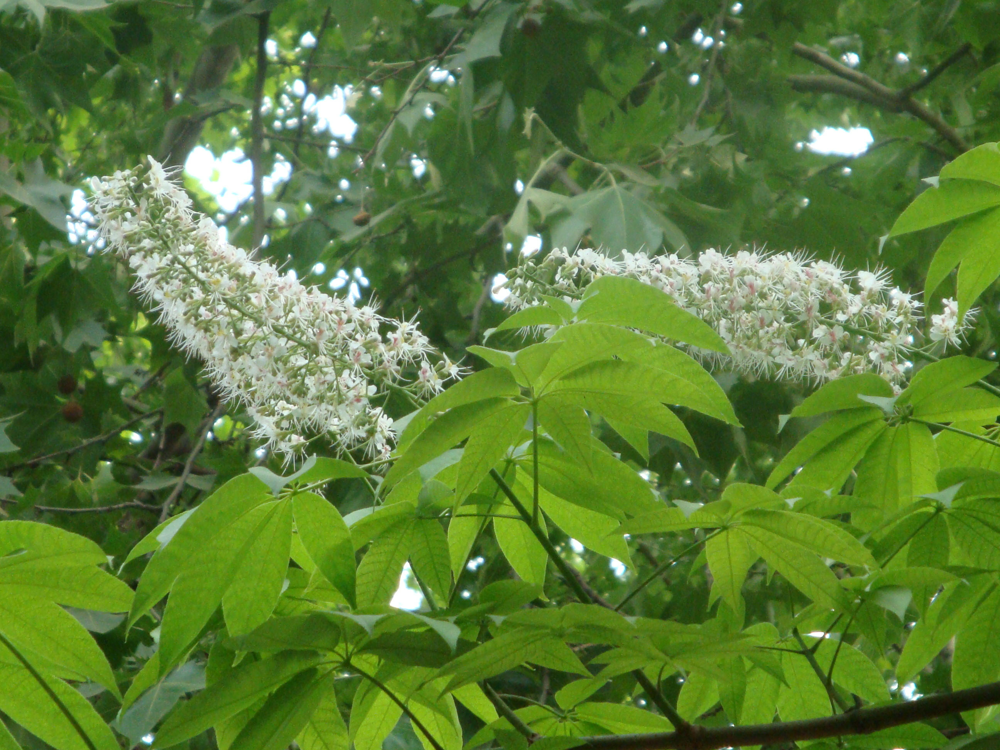

## 七叶树

---

**拉丁名:**  _Aesculus chinensis Bunge _

**科 属:** 七叶树科 七叶树属

**别 名:** 桫椤树、天师栗、七叶枫树

**原产地:** 中国黄河流域

**形  态:** 落叶乔木，高达20米，树皮灰褐色，有龟裂；枝条光滑粗壮。掌状复叶对生，小叶5～7枚，有柄，小叶长圆状倒披针形或倒卵状长圆形，先端渐尖或急尖，基部宽楔形或近圆形，边缘有细锯齿，花白色，长约1厘米，成长筒状圆锥花序；花瓣4，外边及边缘有短柔毛；花丝较长。蒴果圆球形，顶端钝圆，直径3～4厘米，有厚壁，常有1种子。种子栗褐色，近圆形。花期5～6月，果期9～10月。

**西大分布地:** 北校区见于地质系前西侧；桃园校区见于教工家属区北侧。

**备注:** 2009年5月4日摄于西北大学北校区地质系前西侧。

 

