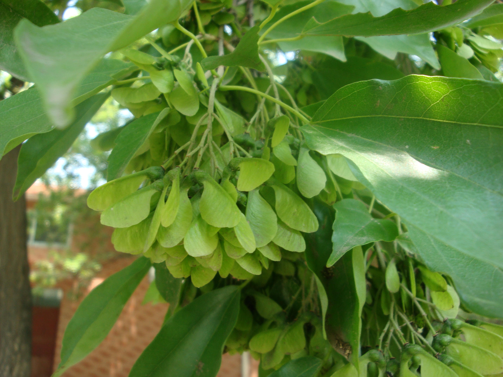
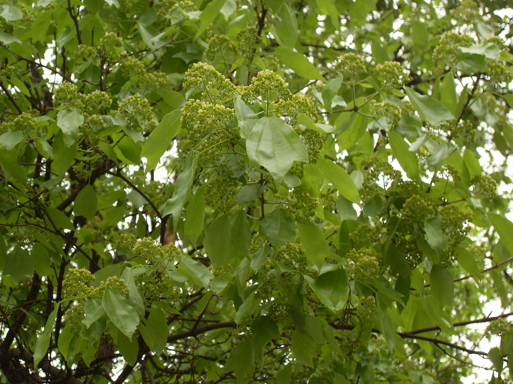

## 三角槭

---

**拉丁名:**  _Acer buergerianum Miq_

**科 属:** 槭树科 槭属

**别 名:** 三角枫

**原产地:** 中国及日本

**形  态:** 落叶乔木，一般高5～10米。树皮暗褐色，薄条片状剥落小枝细幼时有短柔毛，后无毛，稍有白粉。叶常3浅裂，有时不裂，长4～10厘米，基部圆形或广楔形，裂片全缘，叶被有白粉。花杂性，黄绿色，顶生伞房花序。果核部分两面凸起，两果翅张开成锐角或近于平行，花期4月，果期9月。　　　　　

**西大分布地:** 仅于北校区润林苑南侧行道旁有两株。 

**备注:** 上图为三角槭花枝，2009年3月28日摄于西北大学北校区润林苑南侧行道旁；左图为三角槭翅果，2009年5月25日摄于西北大学北校区润林苑南侧行道旁。

 

 

