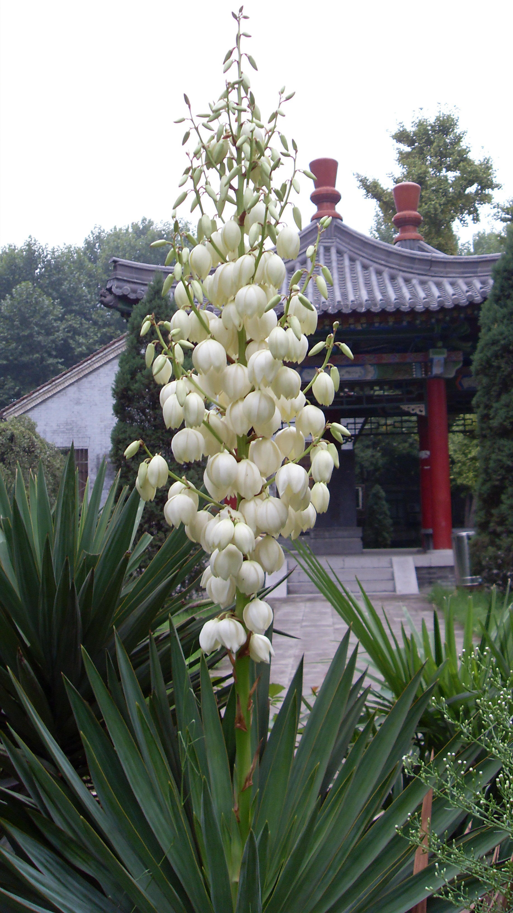
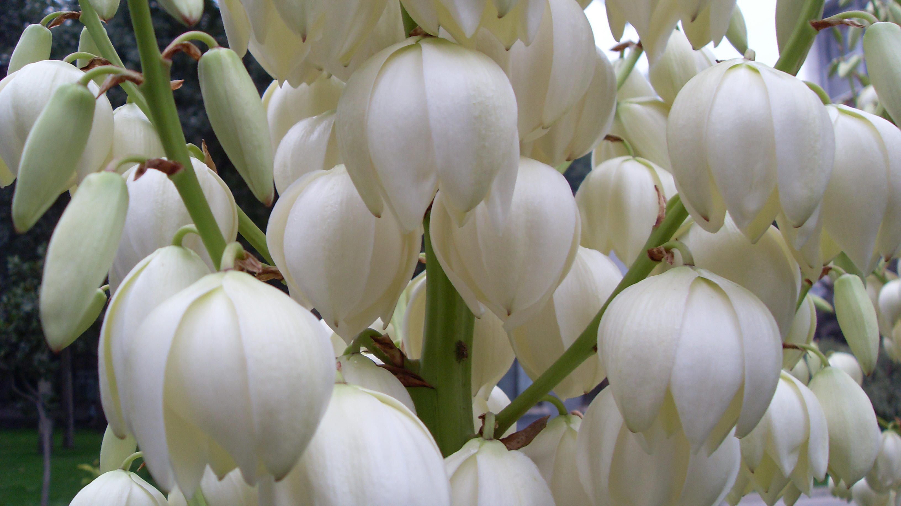

## 丝兰

---

**拉丁名:**  _Yucca fliamentosa L_

**科 属:** 百合科 丝兰属

**别 名:** 菠萝花

**原产地:** 北美

**形  态:** 常绿灌木，茎短，纤维质，具分枝，高可达2.5米。跟肉质。叶广披针形，硬而革质，挺直，丛生宽2.5～4厘米，边缘有剥裂卷曲白色丝线。圆锥形花序长1～1.5米；花下垂，白色至淡黄白色，顶端常带紫红色；花被片6，卵状菱形长4～5.5厘米，宽1，5～2厘米；柱头3裂。果实为开裂的蒴果。

**西大分布地:** 北校区见于化工学院楼后及宝际寺遗址亭周围;南校区见于各处。

**备注:** 2008年9月17日摄于西北大学北校区双百亭东侧行道两侧。

 

 

