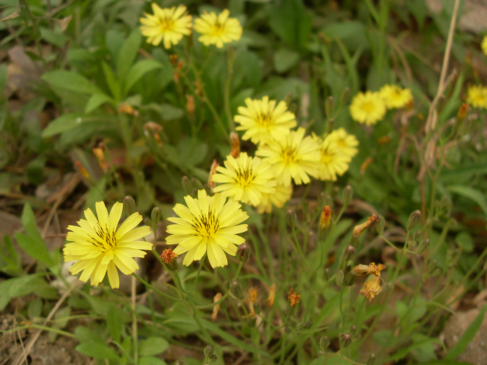

## 中华小苦荬

---

**拉丁名:**  _Ixeridium chinense (Thunb.) Tzvel_

**科 属:** 菊科 小苦荬属

**别 名:** 山苦荬

**原产地:** 不详

**形  态:** 多年生草本，高5～45厘米，无毛。基生叶莲座状，线状披针形或倒披针形，先端钝或急尖，基部下延成狭叶柄，全缘或有疏小齿或不规则羽裂；茎生叶1～2枚，无叶柄，略抱茎。头状花序排成疏散的伞房状聚伞花序，舌状花黄色或白色，先端5齿裂。瘦果狭披针形，略扁平，红棕色，冠毛白色。花果期4～7月。

**西大分布地:** 常见杂草，见于三校区各处。

**备注:** 2009年4月7日摄于西北大学北校区图书馆前花坛内。　

.JPG) 

 

