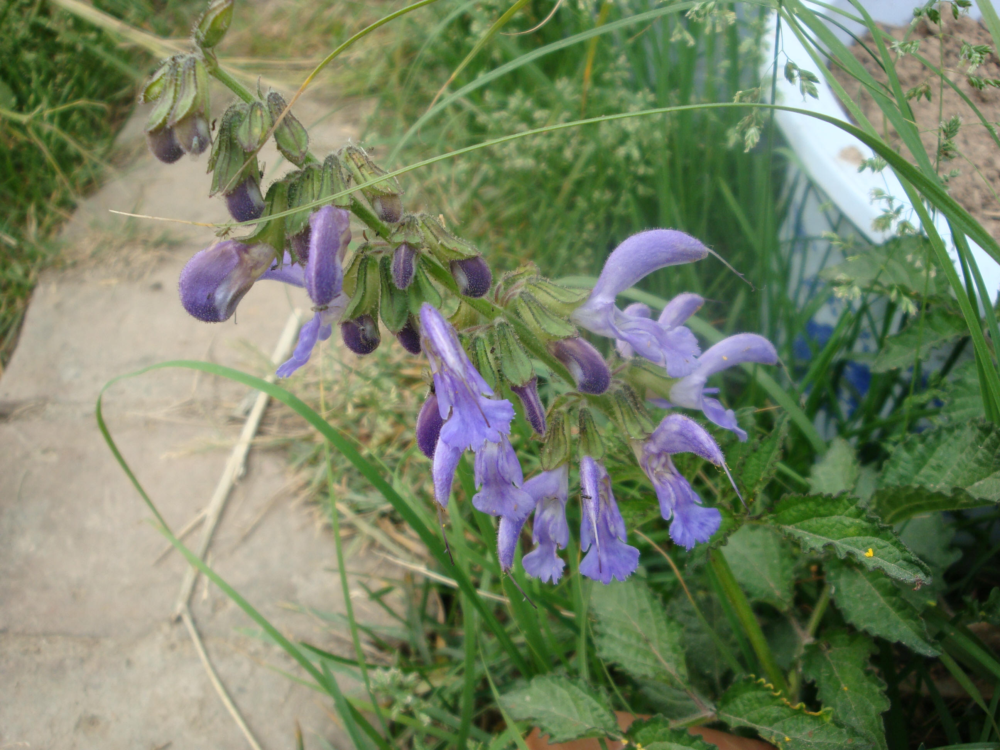

## 丹参

---

**拉丁名:**  _Salvia miltiorrhiza Bunge _

**科 属:** 唇形科 鼠尾草属

**别 名:** 紫丹参、血参、大红袍、红根

**原产地:** 亚洲

**形  态:** 多年生草本。根红色而肥厚。茎高40～80厘米，被长柔毛。叶长为奇数羽状复叶，卵形或椭圆状卵形，长1.5～8厘米，两面被疏柔毛。轮伞花序6至多花，组成腋生或顶生总状花序，密被腺毛或长柔毛，花蓝紫色。小坚果椭圆形。花期5～7月，果期7～11月。

**西大分布地:** 仅见于北校区西大花园内。

**备注:** 2009年5月4日摄于西北大学北校区西大花园内。

 

