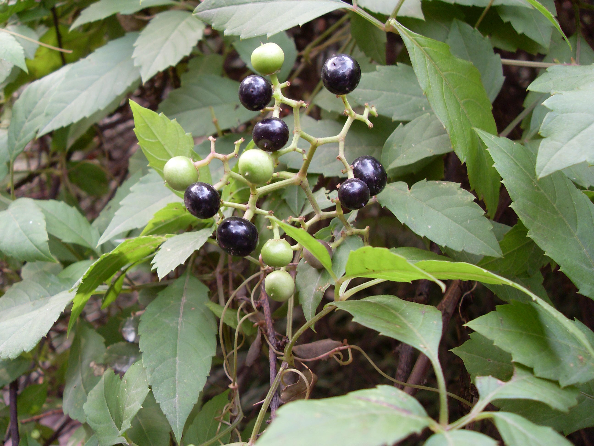
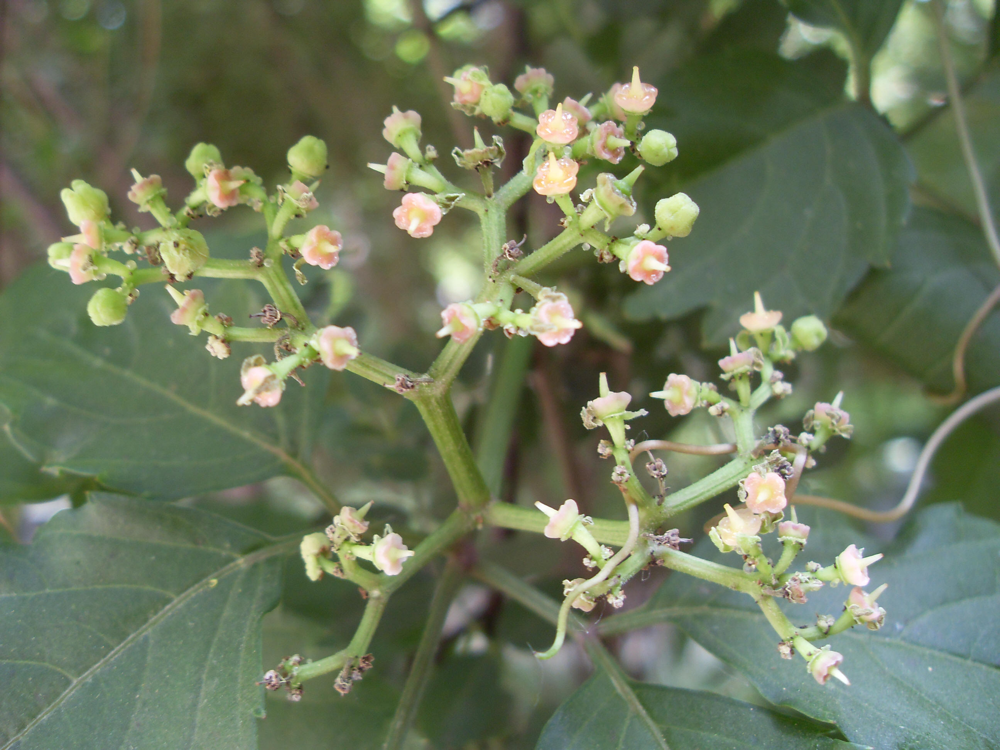

## 乌蔹莓

---

**拉丁名:**  _Cayratia japonica(thunb.) Gagn_

**科 属:** 葡萄科 乌蔹莓属

**别 名:** 五爪龙

**原产地:** 不详

**形  态:** 多年生草纸藤本，茎有卷须。掌状复叶，小叶5，排成鸟足状，中间小叶椭圆状卵形，两侧小叶渐小，成对着生同一叶柄上，各小叶均有小叶柄。伞房状聚伞花序，腋生或假顶生。花瓣4，黄绿色。浆果倒卵形，成熟时黑色。　　　　　　

**西大分布地:** 常见草类，北校区见其覆盖于小型灌木上；南校区多见于待开发区内。

**备注:** 上图为乌蔹莓果实，2008年10月12日摄于西北大学北校区西门南侧花坛内；左图为乌蔹莓花枝，2009年6月15日摄于西北大学北校区化工学院南侧。

 

 

