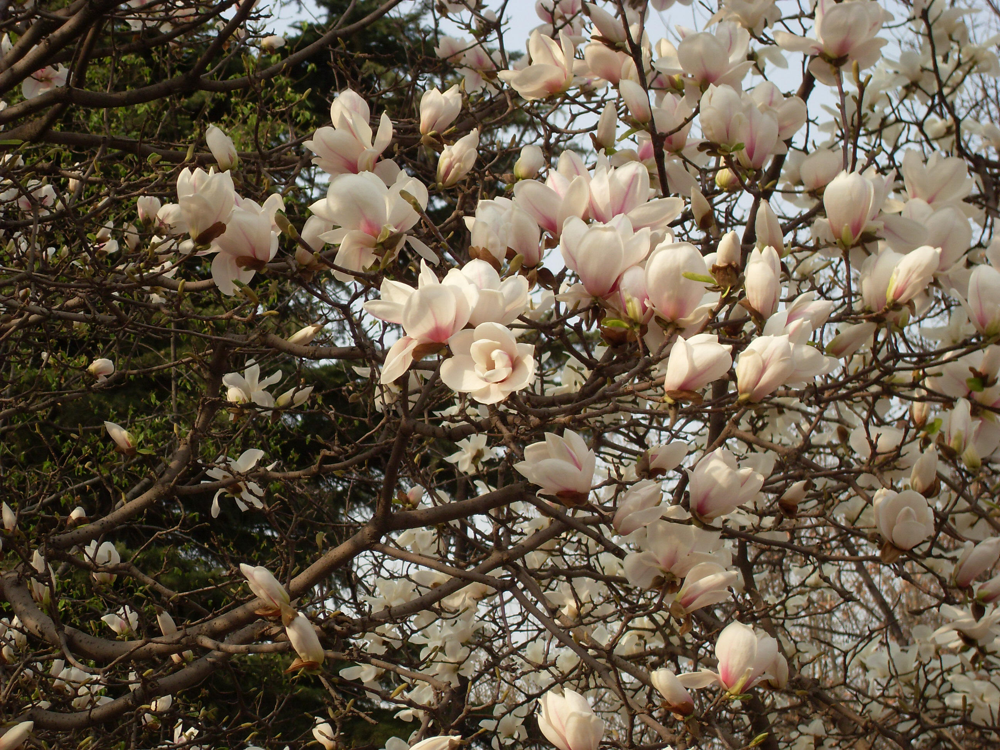
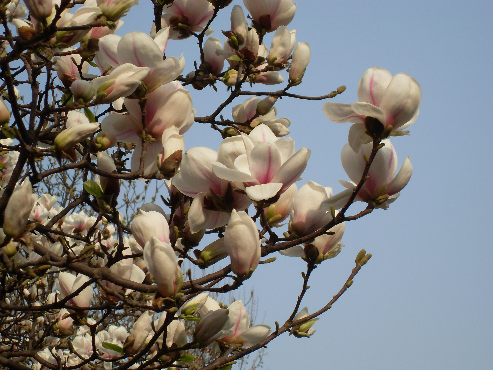
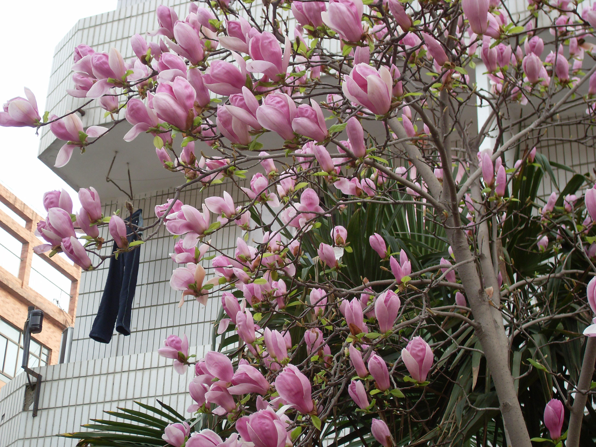

## 二乔玉兰

---

**拉丁名:**  _Magnolia soulangeana Soul.-Bod_

**科 属:** 木兰科 木兰属

**别 名:** 朱砂玉兰【种 源】玉兰与木兰的杂交种，为一园艺品种

**原产地:** 不详

**形  态:** 落叶大灌木或小乔木，高6～10米。树皮灰白色。叶倒卵形，长6～15厘米，宽4～8厘米，先端急尖，基部楔形。花先叶开放，陆续可达两周之久，后期常与叶同时开放，但花形变小；花形大淡红色或近白色，外面近基部或中肋处染紫色晕或条纹，花钟状，有香气，直径10～15厘米，花被片9，长圆状倒卵形。聚合果圆柱状，熟时红色。花期3月，果期8～9月。

**西大分布地:** 西北大学有两个品种，见于北校区图书馆前行道两侧及双百百亭北侧；南校区见于校外四周绿化林中；桃园校区见于学生公寓三号楼出口处及教工家属区东门附近。

**备注:** 上图摄于2009年3月19日西北大学北校区图书馆前行道南。下图摄于2009年3月28日西北大学桃园校区学生公寓三号楼出口处。　　

 

 

 

