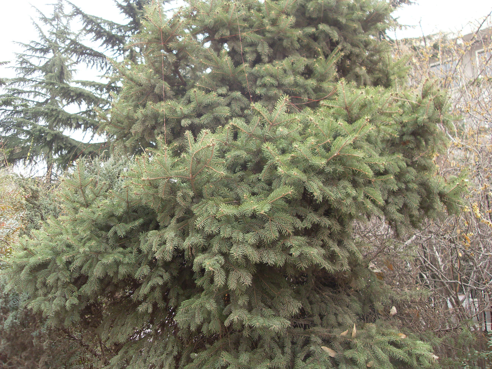

## 云杉

---

**拉丁名:**  _Picea asperata Mast_

**科 属:** 松科 云杉属

**别 名:** 粗枝云杉、大果云杉

**原产地:** 中国特有树种

**形  态:** 常绿乔木，高达45米，树冠圆锥状；小枝光滑或生有短柔毛，一年生枝淡黄至黄褐色；小枝基部宿存芽鳞先端反曲。叶长1～2厘米，先端尖，横切面菱形，上面有5～8条气孔线。雌雄同株，雄球花单生叶腋，椭圆形，黄色或深红色，下垂；雌球花单生枝顶，绿色或红紫色。球果圆柱状，上端渐窄，熟时褐黄色或栗黄色。种子倒卵圆形，带翅。花期4～5月，球果9～10月成熟。

**西大分布地:** 北校区分布于六七号教学楼两侧花坛内。　

**备注:** 2008年3月6日摄于西北大学北校区六号教学楼北侧花坛内。

 

