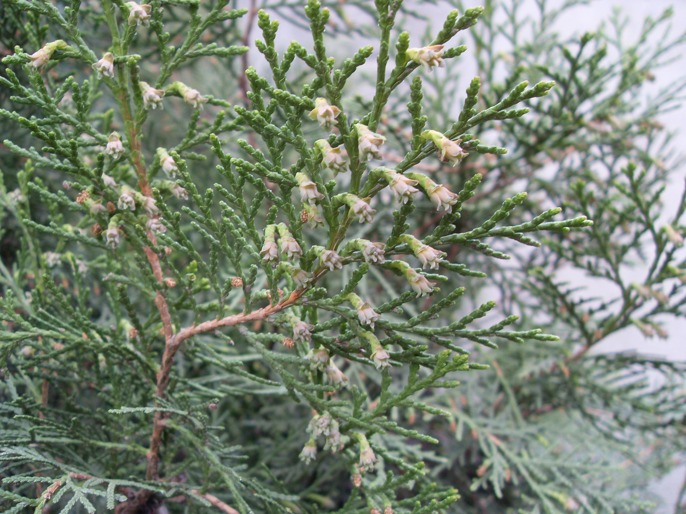
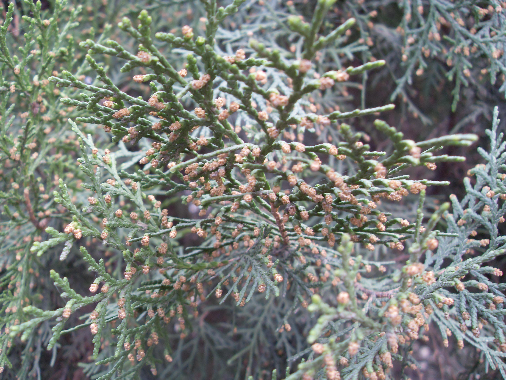

## 侧柏

---

**拉丁名:**  _Platycladus orientalis(Linn.) Franco_

**科 属:** 柏科 侧柏属

**别 名:** 扁柏、香柏

**原产地:** 中国华北、东北及朝鲜

**形  态:** 常绿乔木，高达20米，胸径1米。幼树树冠尖塔形，老树广圆形。树皮薄，浅褐色，呈薄片状剥离，大枝斜出，小枝扁平，无白粉。叶全为鳞片状。雌雄同株，单性，球花单生小枝顶端；雄球花6对雄蕊，雌球花4对珠鳞。球果卵形，长1.5～2.5厘米，熟前绿色，肉质，种鳞顶端反曲尖头，成熟后变木质，开裂，红褐色。种子长卵形，无翅。花期3～4月，果期10～11月。

**西大分布地:** 北校区散见于各行道旁。　

**备注:** 侧柏详细资料：首页下一页上一页【拉丁名】Platycladusorientalis(Linn.)Franco【科属】柏科侧柏属【别名】扁柏、香柏【原产地】中国华北、东北及朝鲜【形态】常绿乔木，高达20米，胸径1米。幼树树冠尖塔形，老树广圆形。树皮薄，浅褐色，呈薄片状剥离，大枝斜出，小枝扁平，无白粉。叶全为鳞片状。雌雄同株，单性，球花单生小枝顶端；雄球花6对雄蕊，雌球花4对珠鳞。球果卵形，长1.5～2.5厘米，熟前绿色，肉质，种鳞顶端反曲尖头，成熟后变木质，开裂，红褐色。种子长卵形，无翅。花期3～4月，果期10～11月。【西大分布地】北校区散见于各行道旁。　备注:上图为侧柏雌球花摄于2009年3月17日西北大学北校区下图为侧柏雄球花摄于2009年3月17日西北大学北校区

 

 

