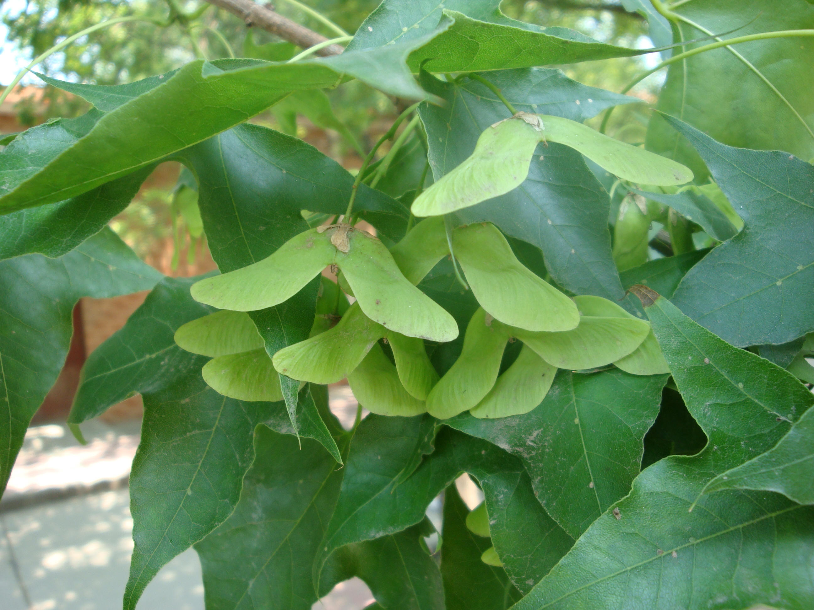
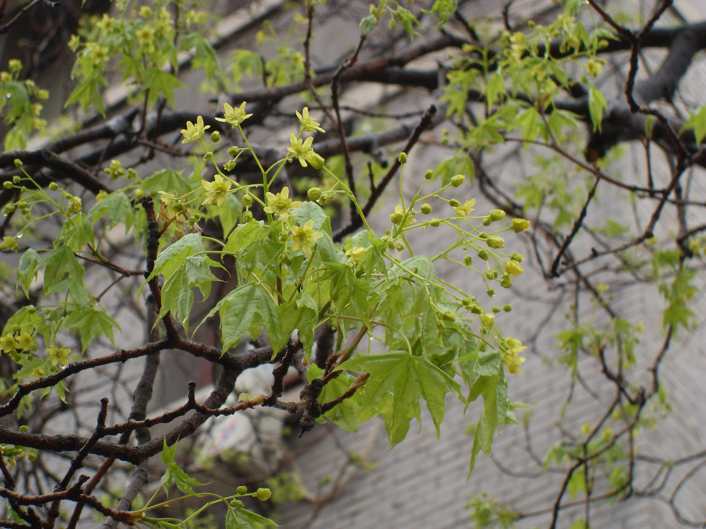

## 元宝槭

---

**拉丁名:**  _Acer truncatum Bunge_

**科 属:** 槭树科 槭属

**别 名:** 平基槭

**原产地:** 中国

**形  态:** 落叶乔木，高达8～10米。树皮纵裂。单叶，对生，纸质常5裂，长5～10厘米，裂片先端渐尖，基部截形，两面无毛；叶柄细长，长3～5厘米。花黄绿色，径约1厘米，成顶生伞房花序。翅果扁平，两翅展开裂成直角，翅较宽，其长度等于或略长于核果。花期4月，叶前或稍前于叶开放；果期10月。　　　　　

**西大分布地:** 见于北校区物理系北侧行道两侧及润林苑前行道。 

**备注:** 上图为元宝槭花枝，2009年3月28日摄于西北大学北校区物理系北侧行道旁；左图为元宝槭翅果，2009年5月25日摄于西北大学北校区润林苑旁行道处。

 

 

