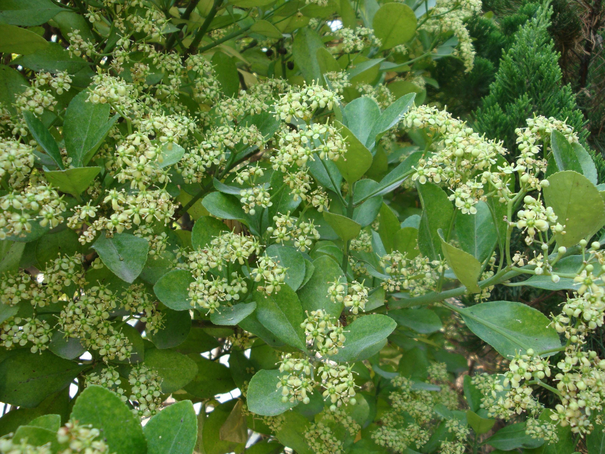

## 冬青卫矛

---

**拉丁名:**  _Euonymus japonicus Thunb _

**科 属:** 卫矛科 卫矛属

**别 名:** 大叶黄杨
 【原产地】日本东部
 【形  态】常绿灌木或小乔木，高可达8米。小枝绿色，稍
  四棱形。叶革质而有光泽，椭圆形至倒卵形，长3～6厘米，
  先端尖或钝，基部广楔形，缘有细锯齿，两面无毛。花绿
  白色，4数，5～12朵成密集聚伞花序，腋生枝条端部。蒴果
  近球形，淡粉红色，熟时4瓣裂；假种皮橘红色。花期5～6
  月，果期9～10月。
     另有一变种，金边大叶黄杨 (Euonymus japonicus Thunb. 
 var. aurea-marginatus Hort.)   
　
　
　
                                                                        【西大分布地】北校区见于图书馆两侧及九号教学楼周围；
                                                                                      南校区见于北门附近草坪中。
                                                                         备注：
                                                                             上图为冬青卫矛花枝，2009年6月15日摄于西北大学北校区图书馆前；
                                                                             左图为金边大叶黄杨，2009年4月24日摄于西北大学南校区北门附近。

**原产地:** 日本东部
【形 态】常绿灌木或小乔木，高可达8米。小枝绿色，稍
 四棱形。叶革质而有光泽，椭圆形至倒卵形，长3～6厘米，
 先端尖或钝，基部广楔形，缘有细锯齿，两面无毛。花绿
 白色，4数，5～12朵成密集聚伞花序，腋生枝条端部。蒴果
 近球形，淡粉红色，熟时4瓣裂；假种皮橘红色。花期5～6
 月，果期9～10月。
 另有一变种，金边大叶黄杨(Euonymus japonicus Thunb. 
var. aurea-marginatus Hort.) 
　
　
　
 【西大分布地】北校区见于图书馆两侧及九号教学楼周围；
 南校区见于北门附近草坪中。
 备注：
 上图为冬青卫矛花枝，2009年6月15日摄于西北大学北校区图书馆前；
 左图为金边大叶黄杨，2009年4月24日摄于西北大学南校区北门附近。

**形  态:** 常绿灌木或小乔木，高可达8米。小枝绿色，稍四棱形。叶革质而有光泽，椭圆形至倒卵形，长3～6厘米，先端尖或钝，基部广楔形，缘有细锯齿，两面无毛。花绿白色，4数，5～12朵成密集聚伞花序，腋生枝条端部。蒴果近球形，淡粉红色，熟时4瓣裂；假种皮橘红色。花期5～6月，果期9～10月。另有一变种，金边大叶黄杨(EuonymusjaponicusThunb.var.aurea-marginatusHort.)　　　

**西大分布地:** 北校区见于图书馆两侧及九号教学楼周围； 南校区见于北门附近草坪中。 

**备注:** 上图为冬青卫矛花枝，2009年6月15日摄于西北大学北校区图书馆前；左图为金边大叶黄杨，2009年4月24日摄于西北大学南校区北门附近。

 

