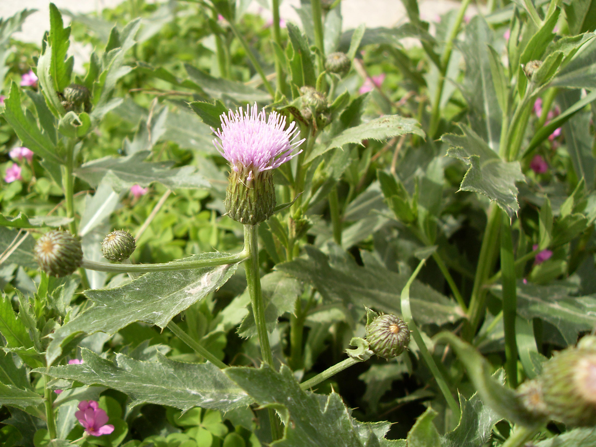

## 刺儿菜

---

**拉丁名:**  _Cirsium setosum (Willd.) MB_

**科 属:** 菊科 蓟属

**别 名:** 小蓟、刺刺芽
【形  态】多年生草本，高20—50厘米。根状茎长，茎直立，有纵
 沟棱，无毛或被蛛丝状毛。叶椭圆或椭圆状披针形，长7～10厘米，
 宽1.5～2.5厘米，先端锐尖，基部楔形或圆形，全缘或有齿裂，有
 刺，两面疏或资被蛛丝状毛。头状花序单生于茎顶，雌雄异株或同
 株，总苞片多层，顶端长尖，具刺；管状花，紫红色。瘦果椭圆或
 长卵形，冠毛羽状。花期4～7月。
【西大分布地】常见杂草，多见于南校区草丛中，北校区偶见。
备注：
    2009年4月24日摄于西北大学南校区待开发区草丛中。 

**原产地:** 刺儿菜
详细资料： 首页 下一页 上一页 
【拉丁名】Cirsium setosum (Willd.) MB.
【科 属】菊科 蓟属
【别 名】小蓟、刺刺芽

**形  态:** 多年生草本，高20—50厘米。根状茎长，茎直立，有纵沟棱，无毛或被蛛丝状毛。叶椭圆或椭圆状披针形，长7～10厘米，宽1.5～2.5厘米，先端锐尖，基部楔形或圆形，全缘或有齿裂，有刺，两面疏或资被蛛丝状毛。头状花序单生于茎顶，雌雄异株或同株，总苞片多层，顶端长尖，具刺；管状花，紫红色。瘦果椭圆或长卵形，冠毛羽状。花期4～7月。

**西大分布地:** 常见杂草，多见于南校区草丛中，北校区偶见。

**备注:** 2009年4月24日摄于西北大学南校区待开发区草丛中。

.JPG) 

 

