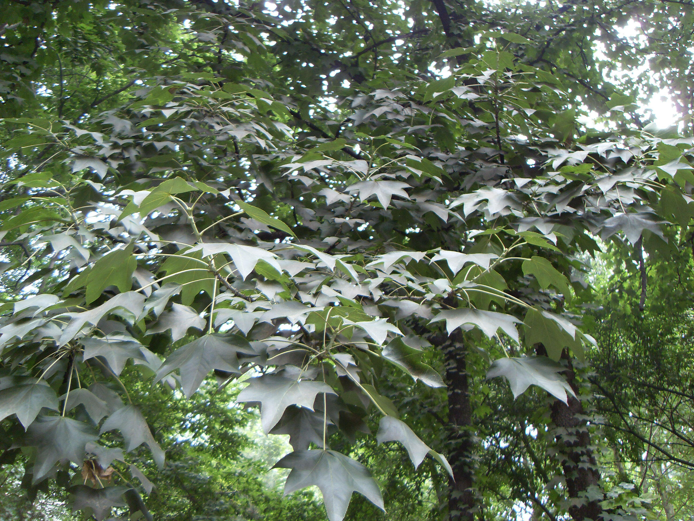

## 刺楸

---

**拉丁名:**  _Kalopanax septemlobus (Thunb.) Koidz _

**科 属:** 五加科 刺楸属

**别 名:** 鸟不宿、钉木树、丁桐皮
 【原产地】中国
 【形  态】落叶乔木，高10～15米，枝干有粗大硕刺。
  单叶互生，叶片横径7～20厘米，掌状5～7裂，裂片
  三角状卵圆形至椭圆状卵形，顶端渐尖或长尖，边缘
  有细锯齿，无毛或背面基部脉腋有毛簇；叶柄长6～
  30厘米。花白色或淡黄绿色。果球形，径约5毫米，
  成熟时蓝黑色。花期7～8月，果熟期10～11月。
 【西大分布地】北校区见于地质系楼北侧林下；
  南校区见于二、五号教学楼间。
备注：
   2009年7月28日摄于西北大学北校区地质系楼北侧林下。

**原产地:** 中国
【形 态】落叶乔木，高10～15米，枝干有粗大硕刺。
 单叶互生，叶片横径7～20厘米，掌状5～7裂，裂片
 三角状卵圆形至椭圆状卵形，顶端渐尖或长尖，边缘
 有细锯齿，无毛或背面基部脉腋有毛簇；叶柄长6～
 30厘米。花白色或淡黄绿色。果球形，径约5毫米，
 成熟时蓝黑色。花期7～8月，果熟期10～11月。
【西大分布地】北校区见于地质系楼北侧林下；
 南校区见于二、五号教学楼间。
备注：
 2009年7月28日摄于西北大学北校区地质系楼北侧林下。

**形  态:** 落叶乔木，高10～15米，枝干有粗大硕刺。单叶互生，叶片横径7～20厘米，掌状5～7裂，裂片三角状卵圆形至椭圆状卵形，顶端渐尖或长尖，边缘有细锯齿，无毛或背面基部脉腋有毛簇；叶柄长6～30厘米。花白色或淡黄绿色。果球形，径约5毫米，成熟时蓝黑色。花期7～8月，果熟期10～11月。

**西大分布地:** 北校区见于地质系楼北侧林下； 南校区见于二、五号教学楼间。

**备注:** 2009年7月28日摄于西北大学北校区地质系楼北侧林下。

 

