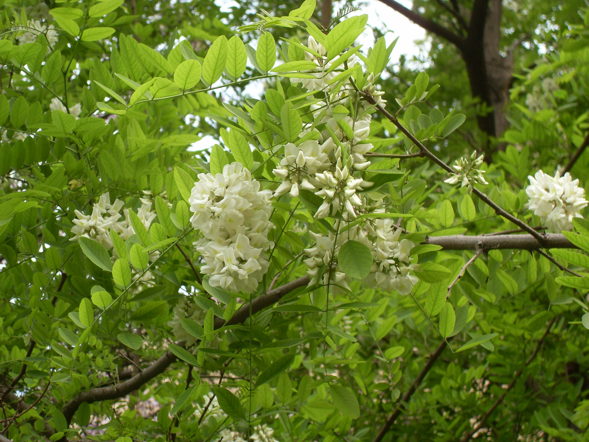

## 刺槐

---

**拉丁名:**  _Robinia pseudoacacia Linn_

**科 属:** 豆科 刺槐属

**别 名:** 洋槐

**原产地:** 北美

**形  态:** 落叶乔木，高10～25cm，树冠椭圆状倒卵形。树皮灰褐色，纵裂；枝条具托叶刺；冬芽小，奇数羽状复叶，小叶7～19，椭圆形至卵状长圆形，长2～5cm，叶端钝或微凹，有小尖头。花蝶形，白色，芳香，成腋生总状花序荚果扁平，长4～10cm；种子肾形，黑色。花期五月；果10～11成熟。

**西大分布地:** 北校区见于教学楼四周；桃园校区见于文化广场处。

**备注:** 2009年4月17日摄于西北大学北校区八号教学楼后。

.JPG) 

 

