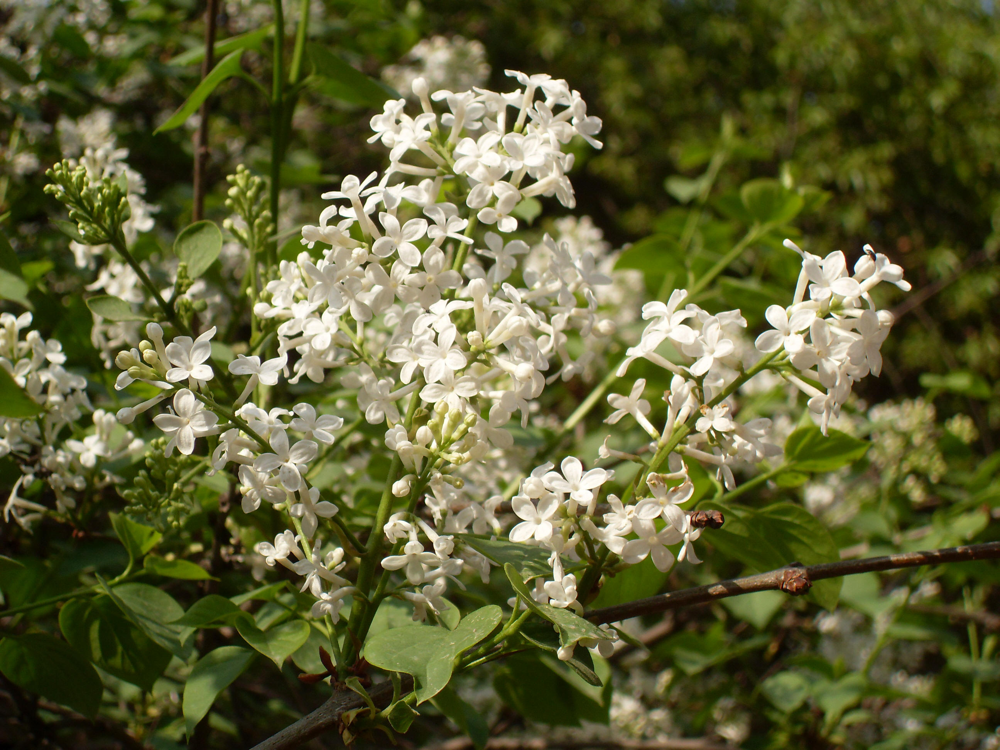

## 北京丁香

---

**拉丁名:**  _Syringa pekinensis Rupr_

**科 属:** 木犀科 丁香属

**别 名:** 臭多萝、山丁香

**原产地:** 中国北部

**形  态:** 落叶灌木，高可达5米。叶卵形至卵状披针形，纸质，无毛，顶端渐尖，基部楔形。圆锥花序腋生，长5～20厘米，宽3～18厘米，花冠白色，花冠简短，与萼裂片近等长。蒴果长椭圆形至披针形，顶端尖，褐色。花期4～5月；果熟期10月。

**西大分布地:** 北校区见于行政楼前、七号教学楼东及生命科学学院南侧。　

**备注:** 2009年3月23日摄于西北大学北校区生命科学学院南侧。　

 

 

