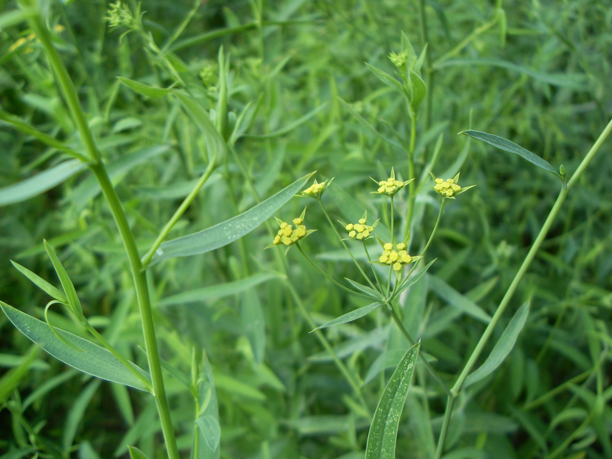

## 北柴胡

---

**拉丁名:**  _Bupleurum chinense DC _

**科 属:** 伞形科 柴胡属

**别 名:** 硬柴胡、竹叶柴胡
 【原产地】中国
 【形  态】多年生草本，高50～80厘米。主根较粗大，棕褐色
  。茎单一或数个，表面有细纵槽纹，上部多分枝，微作之字曲
  折。基生叶倒披针形或狭椭圆形，尖端渐尖，基部收缩成柄；
  茎中部叶倒披针形或广线状披针形；茎顶叶较小。复伞形花序
  多数，总花柄细；花瓣鲜黄色。果广椭圆形，棕色。花期7～9
  月，果期8～10月。
 【西大分布地】仅见于北校区西大花园内。
备注：
    2009年7月27日摄于西北大学北校区西大花园内。

**原产地:** 中国
【形 态】多年生草本，高50～80厘米。主根较粗大，棕褐色
 。茎单一或数个，表面有细纵槽纹，上部多分枝，微作之字曲
 折。基生叶倒披针形或狭椭圆形，尖端渐尖，基部收缩成柄；
 茎中部叶倒披针形或广线状披针形；茎顶叶较小。复伞形花序
 多数，总花柄细；花瓣鲜黄色。果广椭圆形，棕色。花期7～9
 月，果期8～10月。
【西大分布地】仅见于北校区西大花园内。
备注：
 2009年7月27日摄于西北大学北校区西大花园内。

**形  态:** 多年生草本，高50～80厘米。主根较粗大，棕褐色。茎单一或数个，表面有细纵槽纹，上部多分枝，微作之字曲折。基生叶倒披针形或狭椭圆形，尖端渐尖，基部收缩成柄；茎中部叶倒披针形或广线状披针形；茎顶叶较小。复伞形花序多数，总花柄细；花瓣鲜黄色。果广椭圆形，棕色。花期7～9月，果期8～10月。

**西大分布地:** 仅见于北校区西大花园内。

**备注:** 2009年7月27日摄于西北大学北校区西大花园内。

.JPG) 

 

