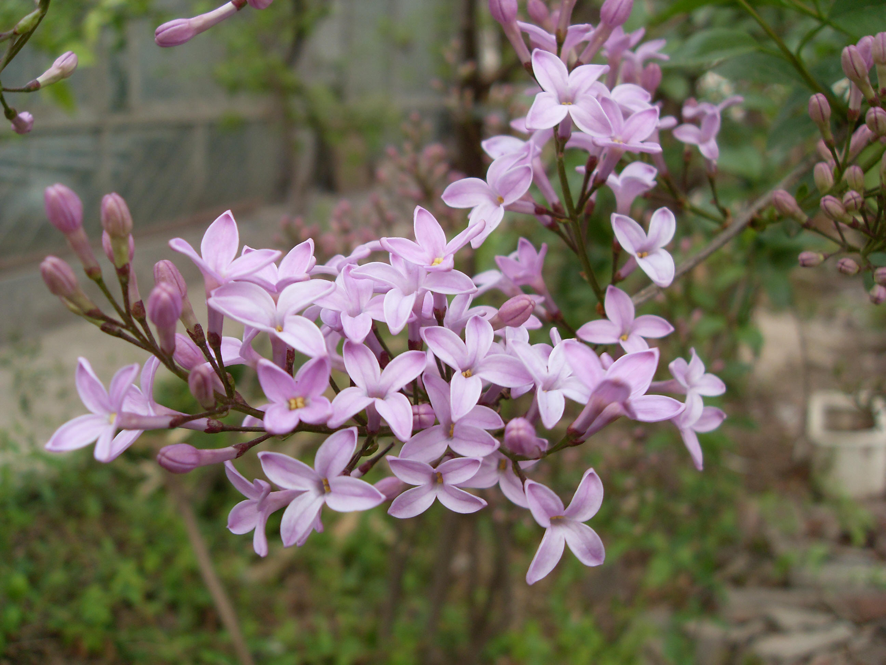

## 华丁香

---

**拉丁名:**  _Syringa protolaciniata P. S. Green et M. C. Chang_

**科 属:** 木犀科 丁香属

**别 名:** 裂叶丁香、花叶丁香

**原产地:** 中国甘肃东部和南部、青海东部

**形  态:** 落叶小灌木，高0.5～3米，枝条棕褐色，小枝紫褐色，细弱，四棱形。叶全缘或分裂，枝条上部叶及花枝上的叶多全缘，下部的叶常3～9羽状深裂至全裂，叶片与裂片倒卵形、长圆状椭圆形至披针形，先端锐尖，基部楔形。圆锥形花序由侧芽抽出长2～10厘米；花芳香，花淡紫色或紫色。蒴果长圆形至长卵形。花期4～5月，果期6～8月。

**西大分布地:** 仅见于北校区西大花园内。

**备注:** 2009年4月2日摄于西北大学北校区西大花园内。

.JPG) 

 

