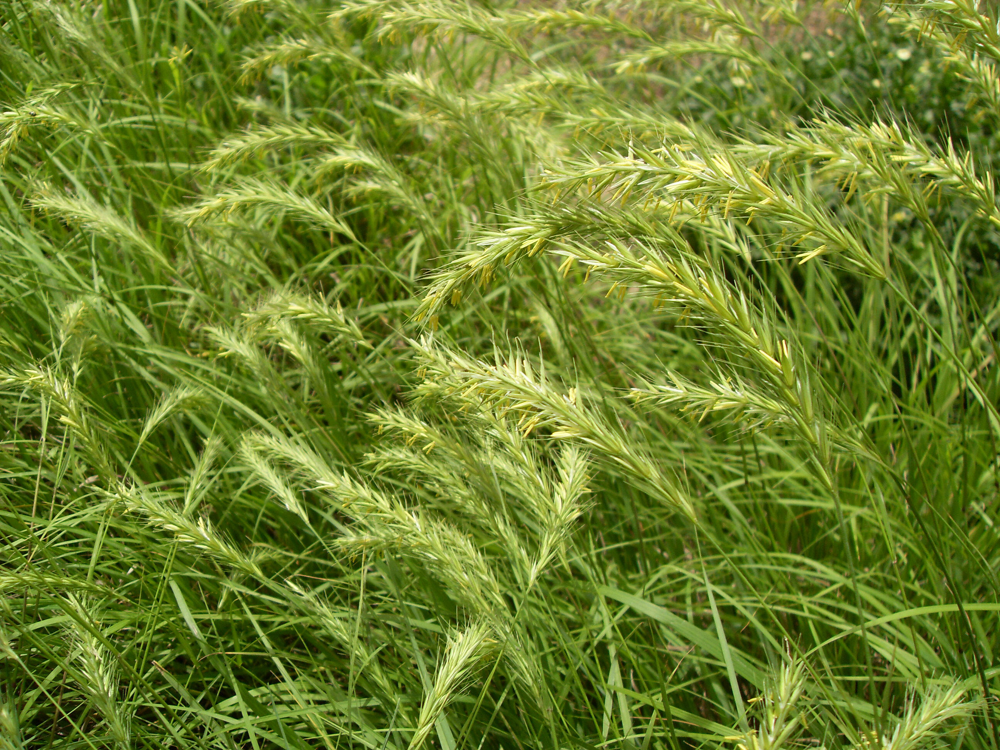

## 华山新麦草

---

**拉丁名:**  _Psathyrostachys huashanica Keng ex P. C. Kuo _

**科 属:** 禾本科 新麦草属

**特 注:** 国家一类珍稀保护植物

**别 名:** Psathyrostachys huashanica Keng ex P. C. Kuo 
【科  属】禾本科  新麦草属
【特  注】国家一类珍稀保护植物

**原产地:** 我国特有的禾草植物，分布仅局限在陕西华山极为狭
小的范围内。

**形  态:** 多年生草本植物，具延长根茎。秆散生，高40～60厘米，径2～3毫米。叶鞘无毛，基部褐紫色或古铜色，长于节间；叶舌长约0.5毫米，顶具细小纤毛；叶片扁平或边缘稍内卷，宽2～4毫米，穗状花序长4～8厘米，宽约1厘米；穗轴很脆，成熟时逐节断落，节间长3.5～4.5毫米，侧棱具硬纤毛，背腹面具微毛；小穗2～3枚生于1节，黄绿色，含1～2小花；小穗轴节间长约3．5毫米；颖锥形，粗糙，长10～12毫米。花、果期5～7月。

**西大分布地:** 仅见于北校区西大花园内。

**备注:** 2009年4月20日摄于西北大学北校区西大花园内。

 

