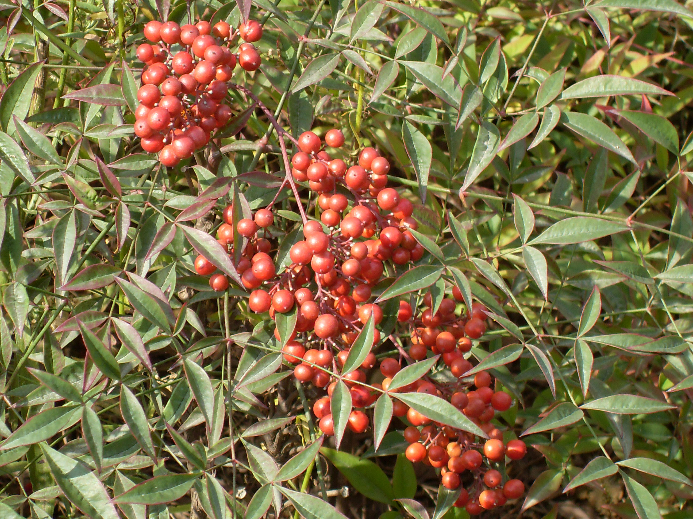
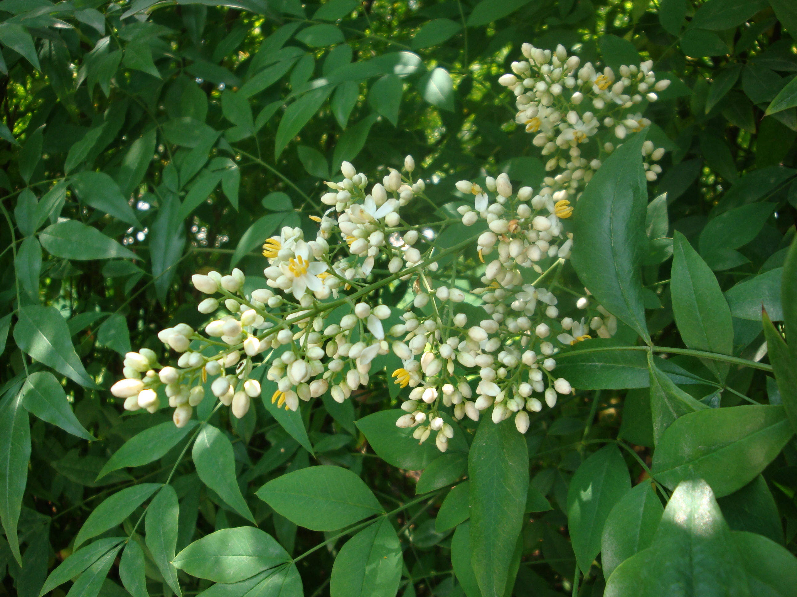

## 南天竹

---

**拉丁名:**  _Nandina domestica Thunb _

**科 属:** 小檗科 南天竹属

**别 名:** 天竺，木兰竹
 【原产地】中国及日本
 【形  态】常绿灌木，高达2米，丛生而分支少。2～3回羽
  状复叶，互生，中轴有关节，小叶椭圆状披针形，长3～10
  厘米，先端渐尖，基部楔形，全缘，两面无毛。花小而白色
  ，成顶生圆锥状，花期5～7月。浆果球形，鲜红色，果9～
  10月成熟。
　
　
　
　
　
                                                                  【西大分布地】三校区均有，多配置于花坛。
                                                                   备注：
                                                                       上图为南天竹果实，2008年10月18日摄于西北大学南校区文学院东侧；
                                                                       左图为南天竹花枝，2009年5月25日摄于西北大学北校区润林苑南侧草坪。

**原产地:** 中国及日本
【形 态】常绿灌木，高达2米，丛生而分支少。2～3回羽
 状复叶，互生，中轴有关节，小叶椭圆状披针形，长3～10
厘米，先端渐尖，基部楔形，全缘，两面无毛。花小而白色
 ，成顶生圆锥状，花期5～7月。浆果球形，鲜红色，果9～
 10月成熟。
　
　
　
　
　
 【西大分布地】三校区均有，多配置于花坛。
 备注：
 上图为南天竹果实，2008年10月18日摄于西北大学南校区文学院东侧；
 左图为南天竹花枝，2009年5月25日摄于西北大学北校区润林苑南侧草坪。

**形  态:** 常绿灌木，高达2米，丛生而分支少。2～3回羽状复叶，互生，中轴有关节，小叶椭圆状披针形，长3～10厘米，先端渐尖，基部楔形，全缘，两面无毛。花小而白色，成顶生圆锥状，花期5～7月。浆果球形，鲜红色，果9～10月成熟。　　　　　

**西大分布地:** 三校区均有，多配置于花坛。 

**备注:** 上图为南天竹果实，2008年10月18日摄于西北大学南校区文学院东侧；左图为南天竹花枝，2009年5月25日摄于西北大学北校区润林苑南侧草坪。

 

 

