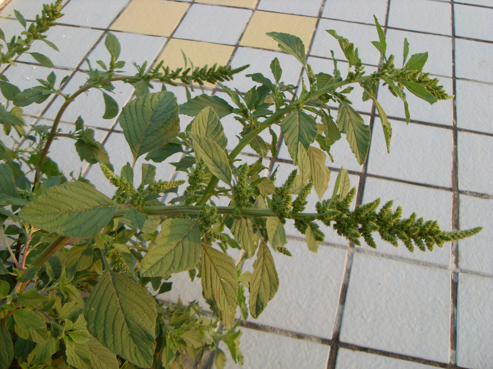

## 反枝苋

---

**拉丁名:**  _Amaranthus retroflexus Linn_

**科 属:** 苋科 苋属

**别 名:** 野苋菜

**原产地:** 美洲

**形  态:** 一年生草本，高20～80厘米；茎直立，粗壮，淡绿色，有时具带紫色条纹，稍具钝棱，密生短柔毛。叶片菱状卵形或椭圆状卵形，常5～12厘米，宽2～5厘米，先端锐尖或尖凹，有小凸尖，基部楔形，有柔毛。圆锥花序顶生及腋生，直立，直径2～4厘米，由多数穗状花序形成，顶生花穗较侧生者长；先端具芒尖；花被片白色。胞果扁卵形，环状横裂，包裹在宿存花被片内。种子近球形，直径1mm，棕色或黑色。花期7～8月，果期8～9月。

**西大分布地:** 常见杂草，见于三校区各处。

**备注:** 2009年7月27日摄于西北大学南校区经管学院前道路旁。　

 

