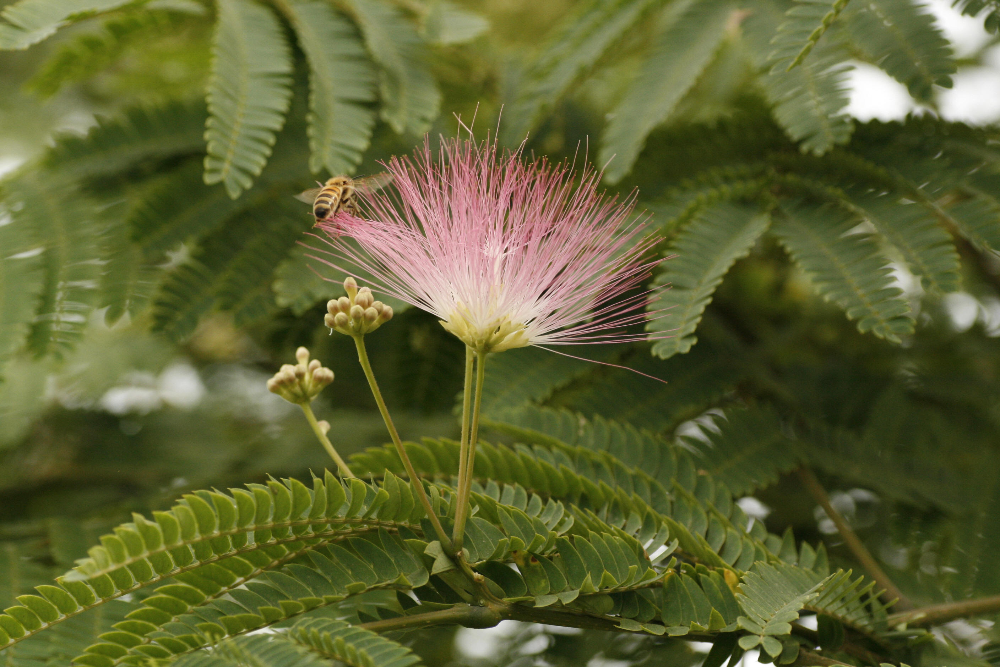
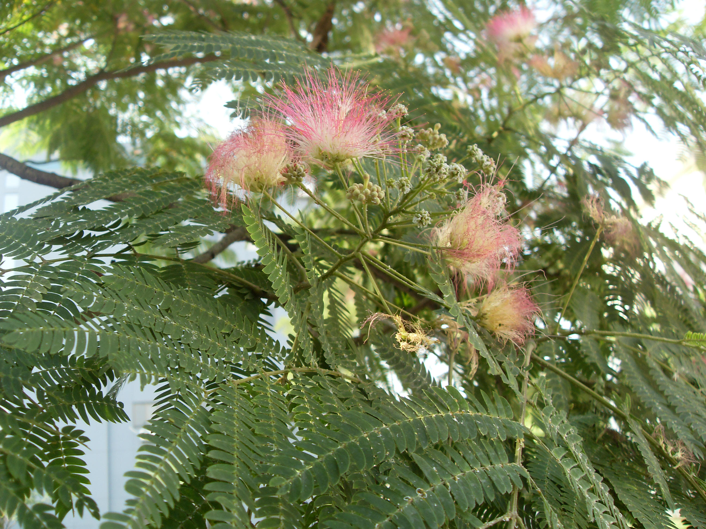

## 合欢

---

**拉丁名:**  _Albizia julibrissin Durazz_

**科 属:** 豆科 合欢属

**别 名:** 绒花树、夜合花

**原产地:** 亚洲、非洲

**形  态:** 落叶乔木，高达16米，树冠扁圆形，常成伞状。树皮褐灰色，主枝较低。叶为2回偶数羽状复叶，羽片4～12对，各有小叶10～30对；小叶镰刀状长圆形，长6～12毫米，宽1～4毫米。花序头状，多数，细长之总柄排成伞房状，腋生或顶生；萼及花瓣均黄绿色；雄蕊多数，绒缨状，粉红色。荚果扁条形，长9～17厘米。花期6～7月，果期9～10月。

**西大分布地:** 北校区见于七号教学楼后动力中心西侧。

**备注:** 2009年6月4日摄于西北大学北校区动力中心西侧。

 

 

