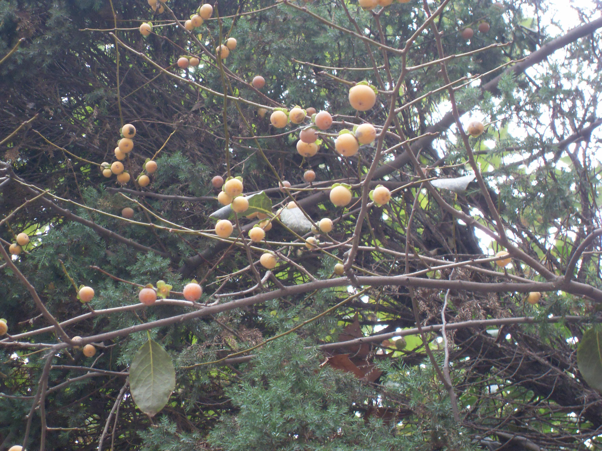
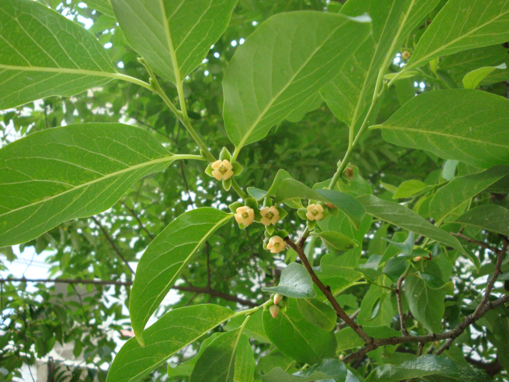

## 君迁子

---

**拉丁名:**  _Diospyros Lotus L_

**科 属:** 柿树科 柿树属

**别 名:** 黑枣，软枣，红蓝枣

**原产地:** 中国

**形  态:** 落叶乔木，高达2米。树皮灰色，呈方块状深裂。幼枝被灰毛，叶长椭圆形，长椭圆状卵形，叶表光滑，叶被灰绿，有灰色毛。花淡橙色或绿白色，花期4～5月。果球形或圆卵形，径1.2～1.8厘米，幼时橙色，熟时变蓝黑色，外被白粉。宿存萼先端圆钝形，果期9～10月。　　　　　

**西大分布地:** 多分布于北校区化工学院南门口西侧，化学系南侧，生科院北楼后。

**备注:** 左图为君迁子果枝，2008年10月12日摄于西北大学北校区化工学院南门口西侧。上图为君迁子花枝，2009年5月4日摄于西北大学北校区生科院楼后。

 

 

 

