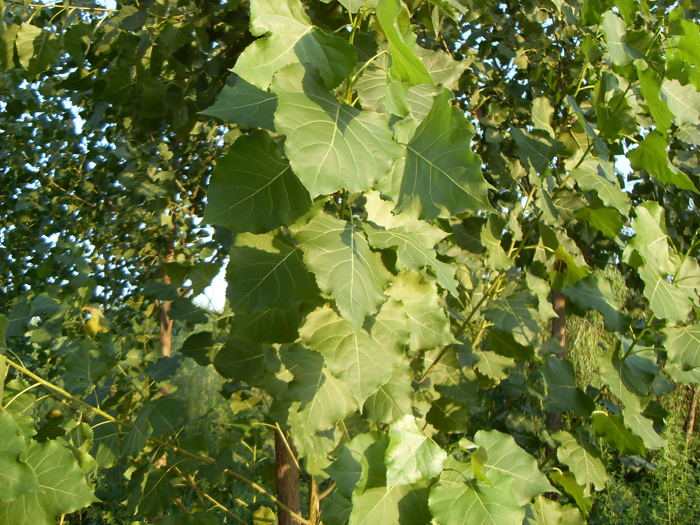
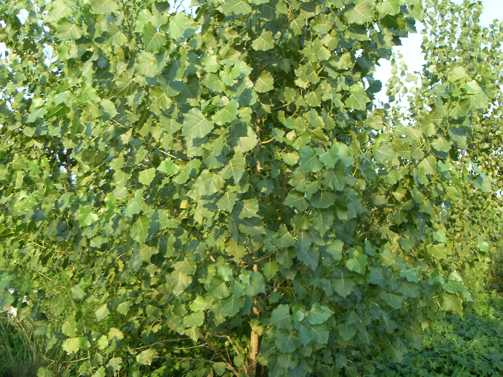

## 响叶杨

---

**拉丁名:**  _Populus adenopoda Maxim_

**科 属:** 杨柳科 杨属

**别 名:** 风响树、团叶白杨

【形  态】乔木，高达30米。树冠卵圆形；树皮灰白色，
  幼时光滑，有菱形皮孔；小枝有柔毛。叶卵形，长5—
  10或15厘米，宽4—7厘米，顶端渐尖，基部截形或心形
  ，边缘锯齿内弯有腺体，背面幼时密生短绒毛；叶柄扁
  ，幼时有短柔毛，顶端有1对显著的腺体；托叶线形，
  长2—2。5厘米，早落。雄花序长6一10厘米；雌花序长
  5—6厘米，花轴密生短柔毛。果序长12—16厘米；蒴果
  卵圆形，2裂，有短柄。花期3月
 【西大分布地】北校区见于研究生公寓周围；南校区见于
  校园各处。
 备注：
     2009年7月27日摄于西北大学南校区。

**原产地:** 响叶杨
详细资料： 首页 下一页 上一页
【拉丁名】Populus adenopoda Maxim.
【科 属】杨柳科 杨属
【别 名】风响树、团叶白杨

**形  态:** 乔木，高达30米。树冠卵圆形；树皮灰白色，幼时光滑，有菱形皮孔；小枝有柔毛。叶卵形，长5—10或15厘米，宽4—7厘米，顶端渐尖，基部截形或心形，边缘锯齿内弯有腺体，背面幼时密生短绒毛；叶柄扁，幼时有短柔毛，顶端有1对显著的腺体；托叶线形，长2—2。5厘米，早落。雄花序长6一10厘米；雌花序长5—6厘米，花轴密生短柔毛。果序长12—16厘米；蒴果卵圆形，2裂，有短柄。花期3月

**西大分布地:** 北校区见于研究生公寓周围；南校区见于 校园各处。

**备注:** 2009年7月27日摄于西北大学南校区。

 

 

