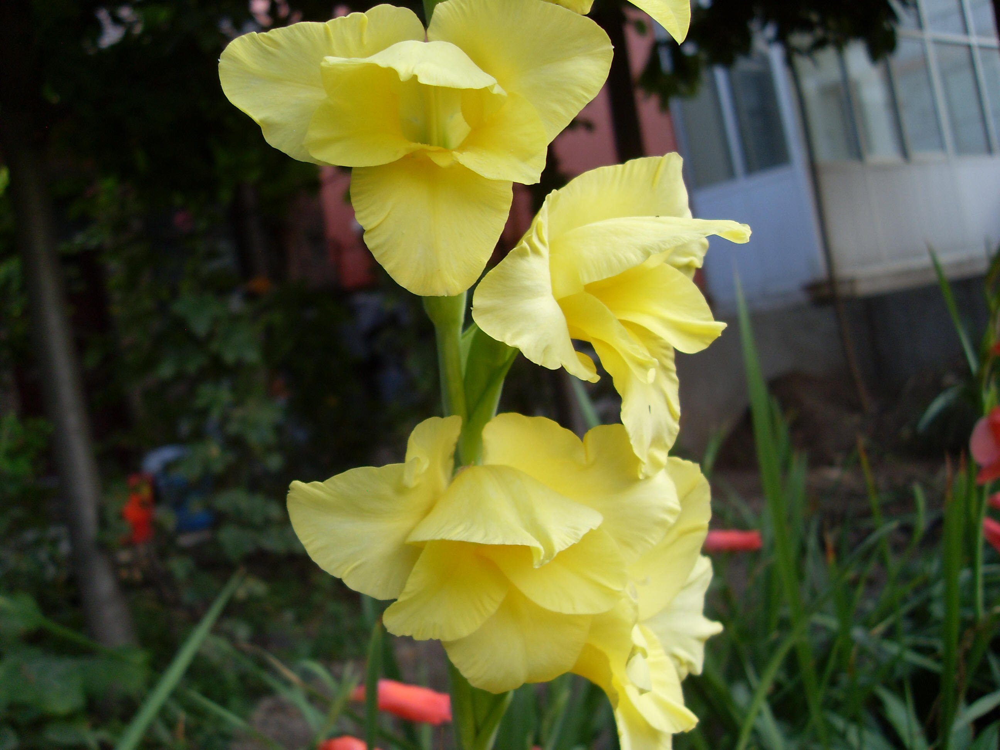

## 唐菖蒲

---

**拉丁名:**  _Gladiolus gandavensis Van Houtte  _

**科 属:** 鸢尾科 唐菖蒲属

**别 名:** 什样锦、剑兰
 【原产地】非洲热带及地中海地区
 【形  态】多年生草本。球茎扁圆形，有褐色膜质外皮。
  基生叶箭形，互生，排成二列，草绿色。花茎自叶丛中
  抽出。穗状花序顶生，每穗着花8～20朵，花色较多。种
  子扁而有翅，花果期7～10月。
 【西大分布地】仅见于北校区西大花园内。
备注：
    2009年7月5日摄于西北大学北校区西大花园内。

**原产地:** 非洲热带及地中海地区
【形 态】多年生草本。球茎扁圆形，有褐色膜质外皮。
 基生叶箭形，互生，排成二列，草绿色。花茎自叶丛中
 抽出。穗状花序顶生，每穗着花8～20朵，花色较多。种
 子扁而有翅，花果期7～10月。
【西大分布地】仅见于北校区西大花园内。
备注：
 2009年7月5日摄于西北大学北校区西大花园内。

**形  态:** 多年生草本。球茎扁圆形，有褐色膜质外皮。基生叶箭形，互生，排成二列，草绿色。花茎自叶丛中抽出。穗状花序顶生，每穗着花8～20朵，花色较多。种子扁而有翅，花果期7～10月。

**西大分布地:** 仅见于北校区西大花园内。

**备注:** 2009年7月5日摄于西北大学北校区西大花园内。

.JPG) 

 

