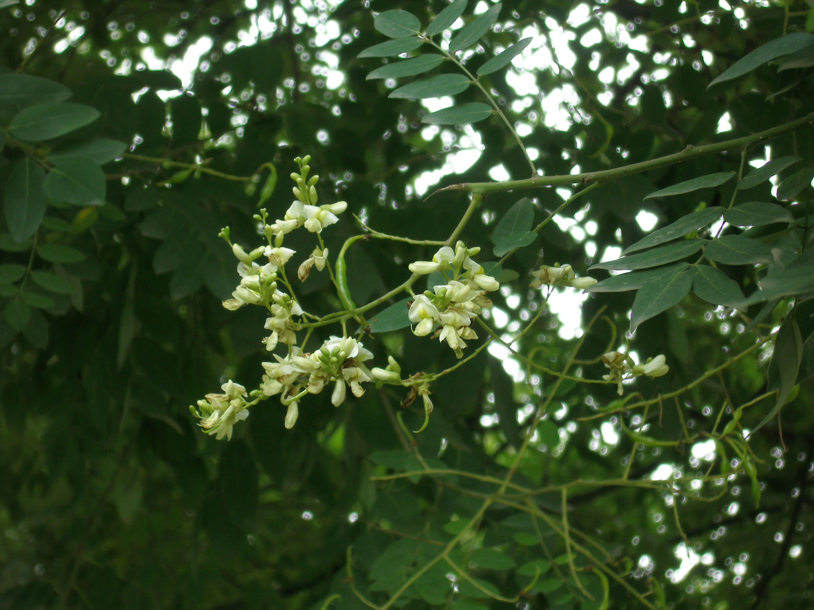

## 国槐

---

**拉丁名:**  _Sophora japonica Linn_

**科 属:** 豆科 槐属

**别 名:** 槐

**原产地:** 中国北部

**形  态:** 落叶乔木，高达25米，树冠圆形；干皮暗灰色，小枝绿色,皮孔明显；奇数羽状复叶，小叶7～17枚，卵形至卵状披针形，长2.5～5厘米，叶端尖，叶基部圆形至广楔形，叶被有白粉及柔毛。花浅黄绿色，排成圆锥花序。荚果串珠状，肉质，长2～8厘米，熟后不开裂，不脱落。花期7～8月，果期10月。　　　

**西大分布地:** 北校区见于生命科学学院东侧行道旁；南校区见于北门主道两旁。

**备注:** 上图为国槐花枝，李智选老师2007年7月30日摄于西北大学北校区；左图为国槐果实，李智选老师2007年7月30日摄于西北大学北校区。

.JPG) 

 

