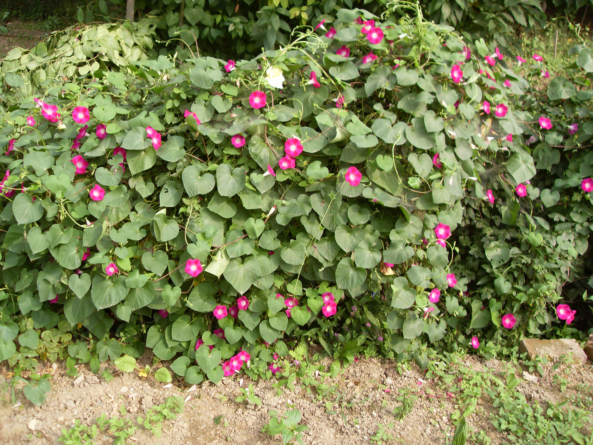

## 圆叶牵牛

---

**拉丁名:**  _Pharbitis purpruea(Linn.) Voigt_

**科 属:** 旋花科 牵牛属

**别 名:** 朝颜

**原产地:** 中国

**形  态:** 一年生草本。茎细长缠绕。叶互生，心型，长5-12厘米，顶端尖，基部心型，花序有花1-5朵，花冠漏斗状，紫色、淡红色或白色，长4-5厘米。蒴果球形，种子卵圆形，无毛，黑色。花果期7-10月。

**西大分布地:** 三校区均有野生，见于草丛中。　

**备注:** 2008年9月22日摄于西北大学北校区西大花园内。

 

 

