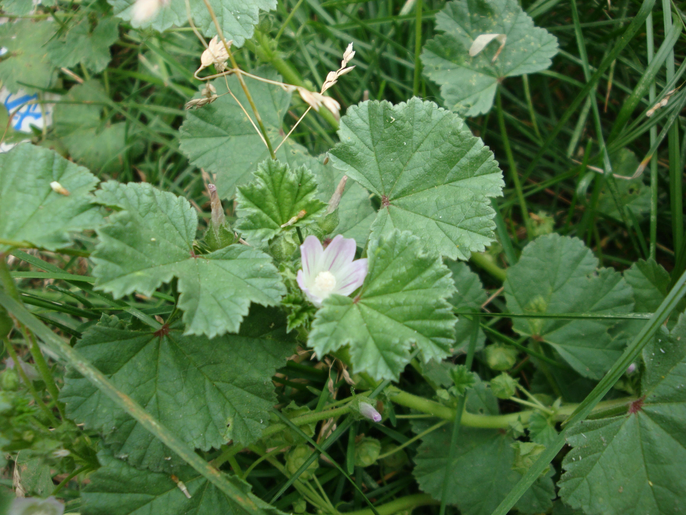

## 圆叶锦葵

---

**拉丁名:**  _Malva rotundifolia Linn_

**科 属:** 锦葵科 锦葵属

**别 名:** 土黄芪、野锦葵

**原产地:** 不详

**形  态:** 多年生草本，根深而粗壮，茎匍匐而生，有粗毛。叶圆肾脏形，有5～7钝浅裂，边缘有钝齿。花白色或浅蓝色，直径约1.5厘米，簇生于叶腋。果实扁球形，径约6毫米，心皮背部密被细毛，皱纹不明显。花期4～6月，果期7月。

**西大分布地:** 常见杂草，见于三校区各处草丛。

**备注:** 2009年6月15日摄于西北大学北校区西大花园内。

 

