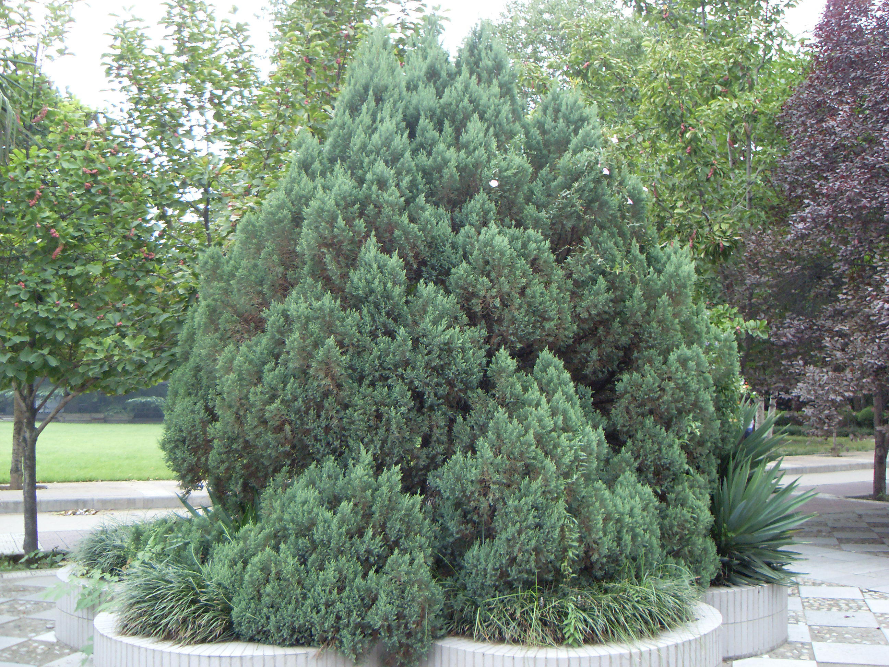
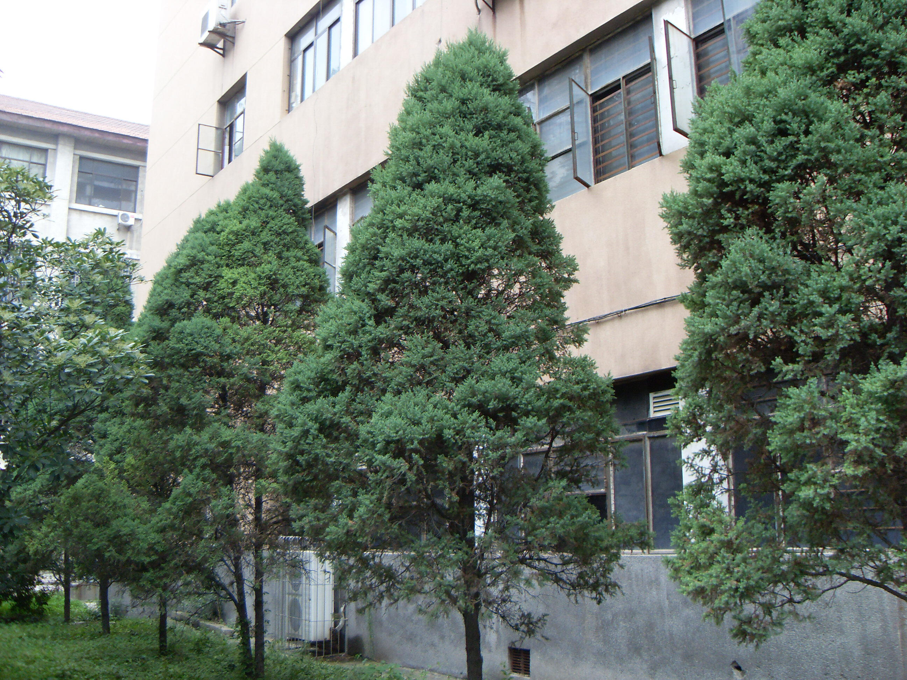
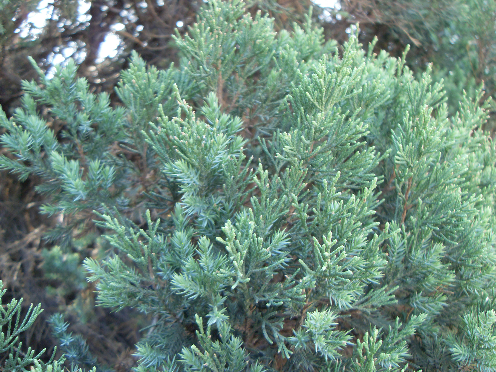

## 圆柏

---

**拉丁名:**  _Sabina chinensis (Linn.) Ant_

**科 属:** 柏科 圆柏属

**别 名:** 柏树、桧、桧柏

**原产地:** 中国

**形  态:** 常绿乔木，高20m,胸径达3-5m。树冠尖塔形或圆锥形，树皮灰褐色，裂成长条片，成狭条纵裂脱落。叶深绿色，有两型叶，鳞形叶交互对生紧抱小枝上；刺形叶披针形，三叶轮生。雌雄异株，少同株，球果近圆球形。花期4月，来年11月果实成熟。　　　　　

**西大分布地:** 常见绿化树，散植于三校区各处。

**备注:** 上图为圆柏树型，2009年8月21日摄于西北大学北校区西大出版社北侧楼下；左图为圆柏两型叶，2009年7月5日摄于西北大学北校区图书馆前。

 

 

 

