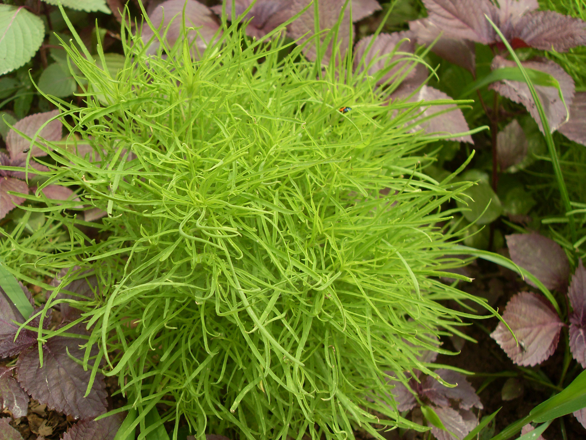

## 地肤

---

**拉丁名:**  _Kochia scoparia (Linn.) Schrad. f. trichophylla           (Hort.) Schinz. et Thell.)   _

**科 属:** 藜科 地肤属

**别 名:** 扫帚菜、孔雀松
【形  态】一年生草本，高50厘米～1.5米。茎直立，多分枝
 ；分枝与小枝散射或斜升，淡绿色或浅红色，幼时有软毛，后
 变光滑。叶片线形或披针形，长3～8厘米，宽4～12毫米，两
 端均渐狭细，全缘，无毛或有短柔毛；无柄。花无梗， 1～2 
 朵生于叶腋；花被5裂，下部联合，结果后，背部各生一横翅
 。胞果扁球形，包在草质花被内。花期7～9月，果期8～10月。
【西大分布地】北校区见于西大花园内。
备注：
    2009年5月30日摄于西北大学北校区西大花园内。

**原产地:** 地 肤
详细资料： 首页 下一页 上一页
【拉丁名】Kochia scoparia (Linn.) Schrad. f. trichophylla 
 (Hort.) Schinz. et Thell.) 
【科 属】藜科 地肤属
【别 名】扫帚菜、孔雀松

**形  态:** 一年生草本，高50厘米～1.5米。茎直立，多分枝；分枝与小枝散射或斜升，淡绿色或浅红色，幼时有软毛，后变光滑。叶片线形或披针形，长3～8厘米，宽4～12毫米，两端均渐狭细，全缘，无毛或有短柔毛；无柄。花无梗，1～2朵生于叶腋；花被5裂，下部联合，结果后，背部各生一横翅。胞果扁球形，包在草质花被内。花期7～9月，果期8～10月。

**西大分布地:** 北校区见于西大花园内。

**备注:** 2009年5月30日摄于西北大学北校区西大花园内。

.JPG) 

 

