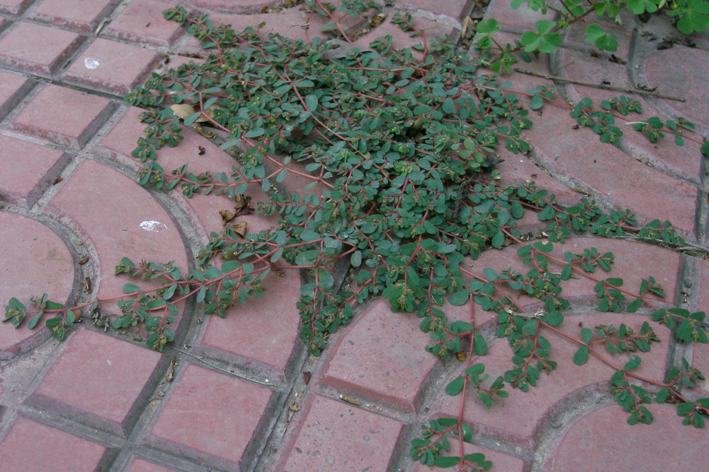
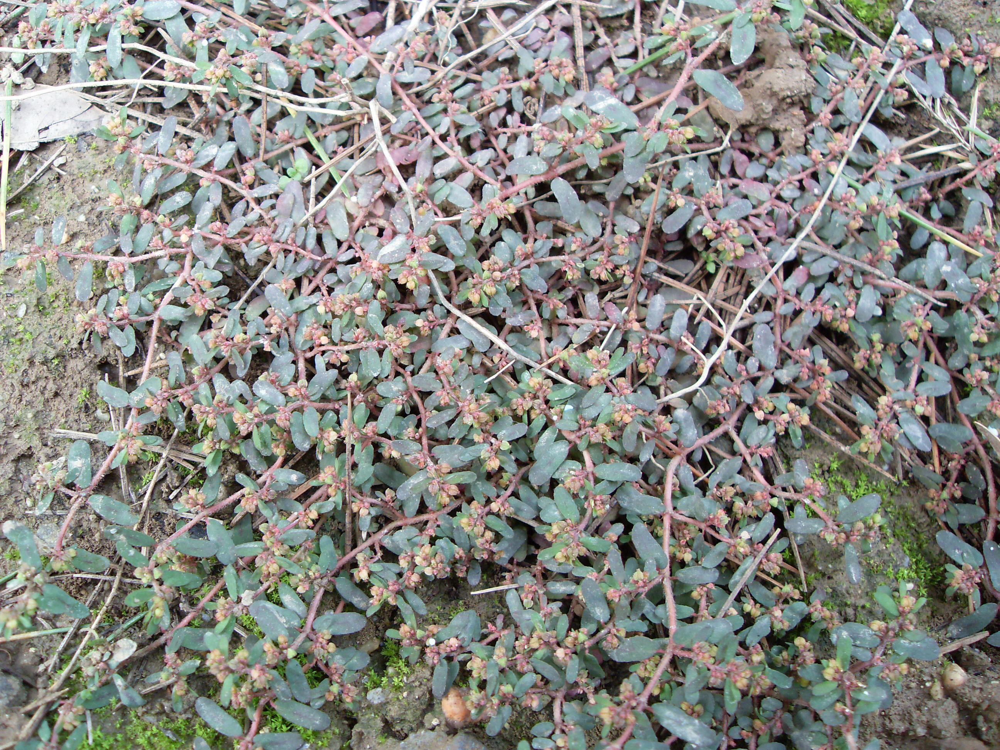

## 地锦

---

**拉丁名:**  _Euphorbia humifusa Willd. ex Schlecht_

**科 属:** 大戟科 大戟属

**别 名:** 红丝草
【形  态】一年生匍生草本；茎叉状分枝。枝柔细，带红紫色
 光滑或疏生柔毛。单叶，常对生，长圆形，长0.6～1厘米，宽
 约4毫米，先端钝圆基部不等边，边缘有细齿，绿色或带红色，
 杯状聚伞花序单生，总苞倒圆锥形，浅红色，边缘常4裂，裂片
 长三角形；腺体4枚，长圆形，具白色花瓣状附属物。蒴果三棱
 状球形。种子卵形，黑褐色，外被白色蜡粉。花果期7～10月。
【西大分布地】三校区常见杂草，见于树荫草丛。
备注：
    2008年10月12日摄于北校区图书馆前花坛内。

**原产地:** 地 锦
详细资料： 首页 下一页 上一页
【拉丁名】Euphorbia humifusa Willd. ex Schlecht.
【科 属】大戟科 大戟属
【别 名】红丝草

**形  态:** 一年生匍生草本；茎叉状分枝。枝柔细，带红紫色光滑或疏生柔毛。单叶，常对生，长圆形，长0.6～1厘米，宽约4毫米，先端钝圆基部不等边，边缘有细齿，绿色或带红色，杯状聚伞花序单生，总苞倒圆锥形，浅红色，边缘常4裂，裂片长三角形；腺体4枚，长圆形，具白色花瓣状附属物。蒴果三棱状球形。种子卵形，黑褐色，外被白色蜡粉。花果期7～10月。

**西大分布地:** 三校区常见杂草，见于树荫草丛。

**备注:** 2008年10月12日摄于北校区图书馆前花坛内。

 

 

