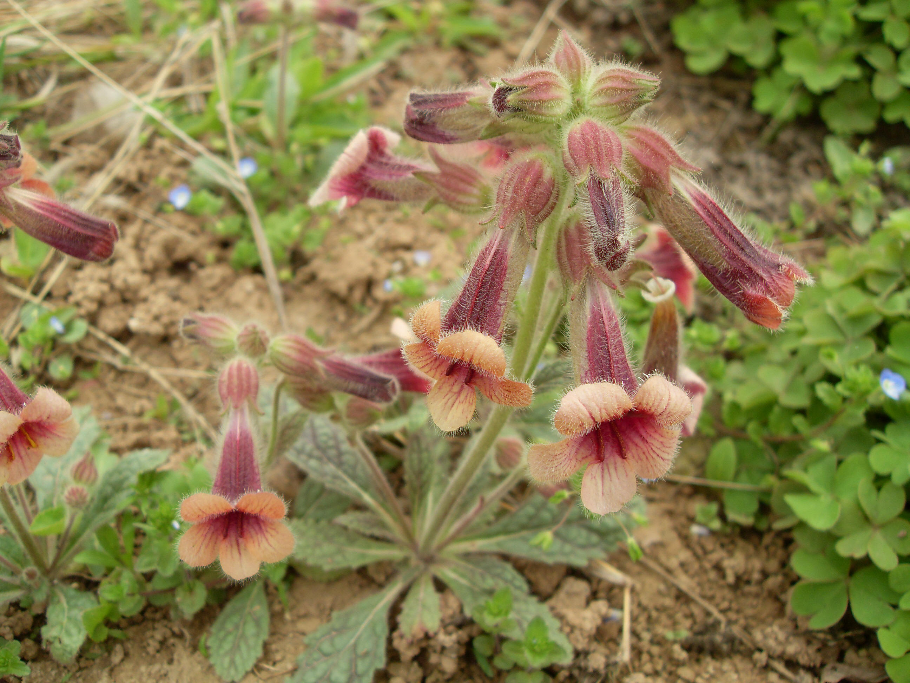

## 地黄

---

**拉丁名:**  _Rehmannia glutinosa (Gaert.) Libosch. ex Fisch. et Mey. _

**科 属:** 玄参科 地黄属

**别 名:** 酒壶花、山白菜

**原产地:** 中国

**形  态:** 多年生草本，全株有白色长柔毛和腺毛。叶基生成丛，倒卵状披针形，基部渐狭成柄，边缘有不整齐钝齿，叶面皱缩，下面略带紫色。花茎由叶丛抽出，花序总状；萼5浅裂；花冠钟形，略2唇状，紫红色，内面常有黄色带紫的条纹。蒴果球形或卵圆形，具宿萼和花柱；种子细小。花期4～6月，果期7～8月。

**西大分布地:** 仅见于南校区待开发区内草丛中。

**备注:** 2009年4月12日摄于西北大学南校区北门待开发区内草丛中。　　

 

