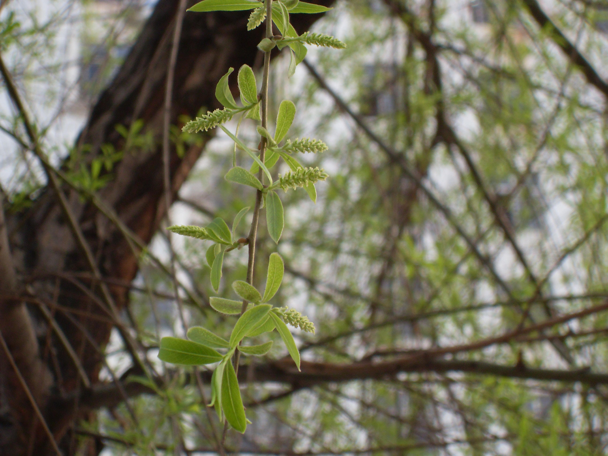

## 垂柳

---

**拉丁名:**  _Salix babylonica Linn_

**科 属:** 杨柳科 杨柳属

**别 名:** 柳树、清明柳，青龙须

**原产地:** 中国长江流域及以南各省

**形  态:** 落叶乔木，高12～25米。树冠开展而疏散，树皮灰褐色，有浅纵沟。枝条长而柔韧，下垂，紫褐色，光滑。叶卵状披针形、狭披针形或线状披针形，长8～16厘米，先端长渐尖，基部狭楔形，边缘有细锯齿，表面暗绿，背面灰绿，光滑；叶柄长4～10毫米。雌雄异花，均有短柄，花序轴有短柔毛；雄花序黄绿色，圆柱形，长约2厘米，有黄色蜜腺2个，雌花序长约3厘米，有1个蜜腺。花期3～4月，果期5月。　

**西大分布地:** 北校区集中在西大医院北侧草坪边缘；南校区桃园校区

**备注:** 上图为垂柳株形于2009年3月17摄于西北大学北校区西大医院北侧草坪边缘；左图为垂柳雄花枝于2009年3月17摄于西北大学北校区西大医院北侧草坪边缘。

 

 

