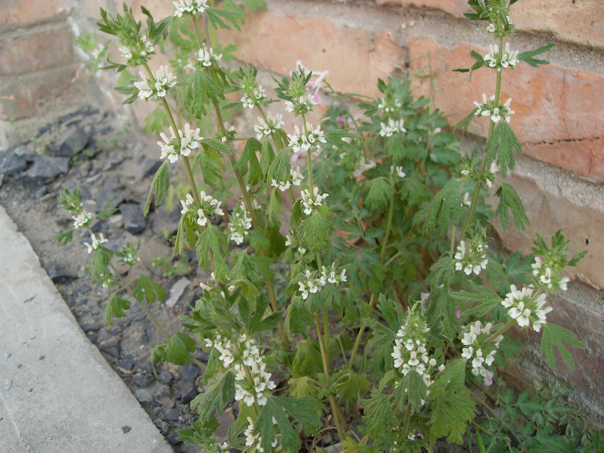

## 夏至草

---

**拉丁名:**  _Lagopsis supina (Steph. ex Willd.) Ik.-Gal. ex Knorr_

**科 属:** 唇形科 夏至草属

**别 名:** 小益母草、风轮草

**原产地:** 不详

**形  态:** 矮小、多年生草本；叶圆形，掌状浅裂或深裂；轮伞花序腋生，多花密集；小苞片针刺状；花小，白色、黄色至褐紫色；花萼管形或管状钟形，具10脉，齿5，其中2齿稍大；花冠筒内面无毛环，冠檐二唇形，上唇直伸，全缘或间有微缺，下唇平展，3裂；花盘全缘。小坚果卵圆状三棱形，光滑或具鳞秕，或具细网纹。花期4～6月，果期5～7月。

**西大分布地:** 早春常见杂草，见于三校区各处。

**备注:** 2009年3月28日摄于西北大学北校区西大花园内。　

 

 

