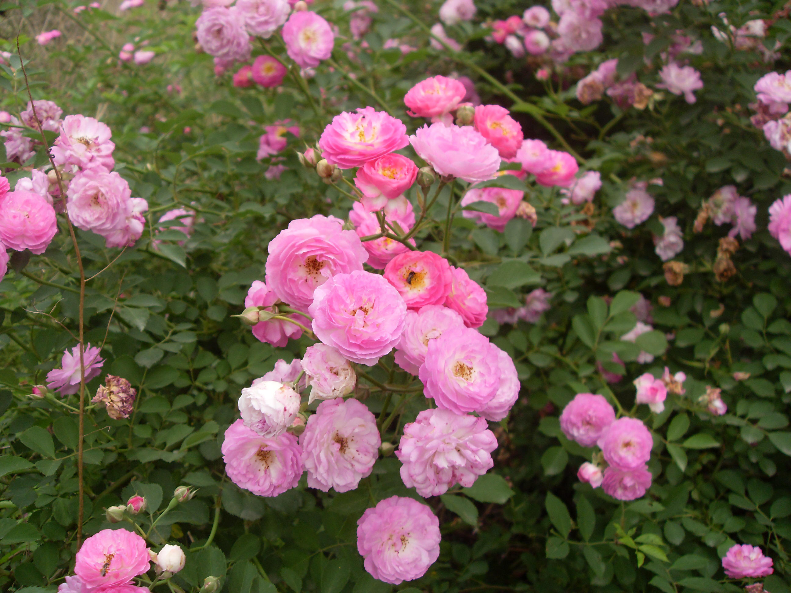

## 多花蔷薇

---

**拉丁名:**  _Rosa multiflora Thunb. var. carnea Thory_

**科 属:** 蔷薇科 蔷薇属

**别 名:** 七姐妹

**原产地:** 原种产中国，本种为园艺变种

**形  态:** 此种蔷薇花“七姊妹”是多花蔷薇的变种，羽状复叶，叶梗附近长有直立棘刺1对，通常有5枚边缘有细齿且带尖端的卵形小叶，互生。尤其突出的是，这种蔷薇的同一枝茎上通常开七朵花型较大的重瓣花，并且颜色从粉红、红色到紫红色。花有香味。聚合果近球形，红褐色。花期4～6月，果期8～9月。

**西大分布地:** 北校区见于西大花园；南校区见于待开发区。

**备注:** 2009年4月20日摄于西北大学南校区待开发区内。

.JPG) 

 

