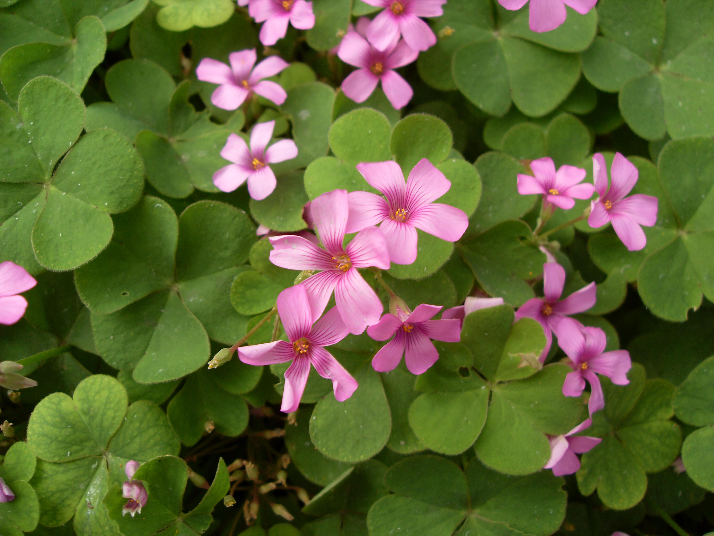

## 多花酢浆草

---

**拉丁名:**  _Oxalis corymbosa DC_

**科 属:** 酢浆草科 酢浆草属

**别 名:** 红花酢浆草

**原产地:** 巴西

**形  态:** 多年生直立无茎草本。地下部分有多数小鳞茎，鳞片褐色。3小叶复叶，均基生，小叶阔倒卵形，长3.5厘米，先端凹缺，被毛；叶柄15～25厘米，被毛。伞房花序基生与叶等长或稍长，有5～10朵花，花淡紫红色，花瓣5。蒴果短条形，角果状，长1.7～2厘米。花果期3～12月。

**西大分布地:** 三校区均有较多分布，北校区集中在图书馆后。　

**备注:** 2008年9月22日摄于西北大学北校区西大附中花坛。

 

