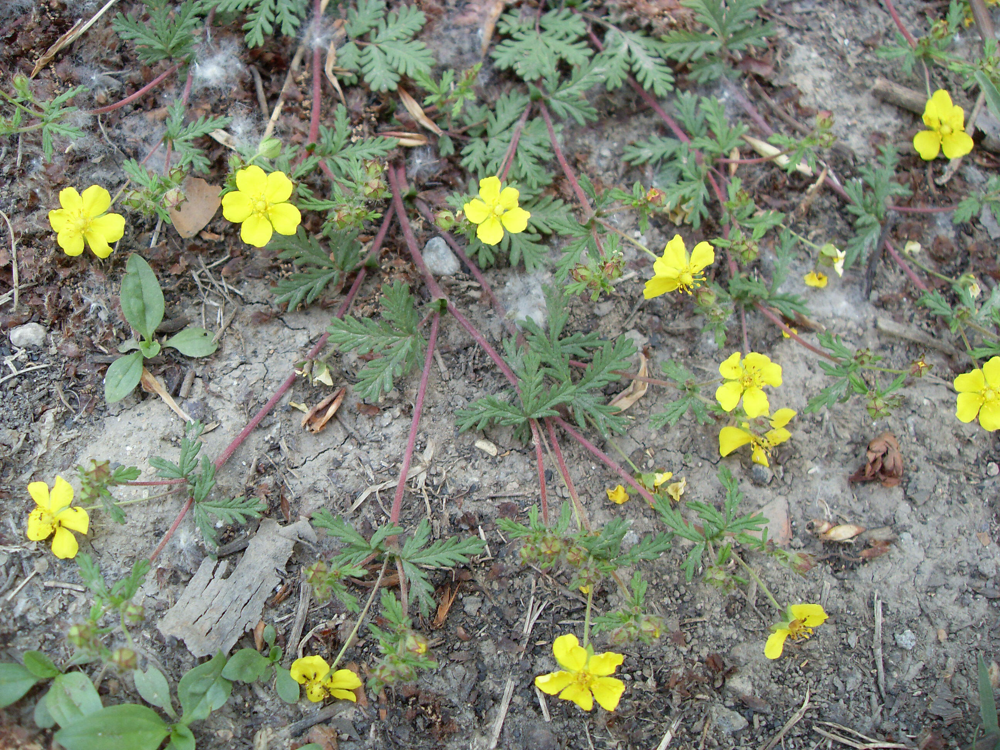
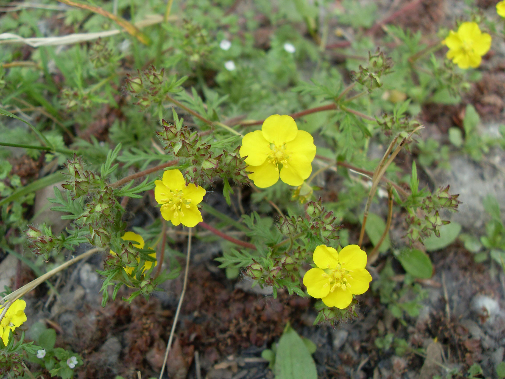

## 多茎委陵菜

---

**拉丁名:**  _Potentilla multicaulis Bge_

**科 属:** 蔷薇科 委陵菜属

**别 名:** 猫爪子
【形  态】一年生草本，高10-30厘米，全株被绒毛。茎多数，
 平卧或近斜升。羽状复叶，叶柄长，疏生开展长毛；小叶5～
 7对，长圆形，长1～2.5厘米，宽0.8`1.1厘米，基部心形，边
 缘为羽状深裂，裂片开展，几乎与中脉成直角，篦齿状，先端
 钝。聚伞花序生于茎顶；花径8-10毫米；萼片卵形，副萼片披针
 形，长约为萼片之半；花瓣黄色，倒卵形，长4毫米，宽3毫米，
 先端圆形。瘦果多数，近圆形，径1毫米，有皱纹。花期5-6月
 ，果期6-8月。
【西大分布地】早春杂草，见于北校区大操场东侧高台草丛。
备注：
    2009年4月7日摄于西北大学北校区大操场东侧高台草丛。

**原产地:** 多茎委陵菜
详细资料： 首页 下一页上一页 
【拉丁名】Potentilla multicaulis Bge.
【科 属】蔷薇科 委陵菜属
【别 名】猫爪子

**形  态:** 一年生草本，高10-30厘米，全株被绒毛。茎多数，平卧或近斜升。羽状复叶，叶柄长，疏生开展长毛；小叶5～7对，长圆形，长1～2.5厘米，宽0.8`1.1厘米，基部心形，边缘为羽状深裂，裂片开展，几乎与中脉成直角，篦齿状，先端钝。聚伞花序生于茎顶；花径8-10毫米；萼片卵形，副萼片披针形，长约为萼片之半；花瓣黄色，倒卵形，长4毫米，宽3毫米，先端圆形。瘦果多数，近圆形，径1毫米，有皱纹。花期5-6月，果期6-8月。

**西大分布地:** 早春杂草，见于北校区大操场东侧高台草丛。

**备注:** 2009年4月7日摄于西北大学北校区大操场东侧高台草丛。

 

 

