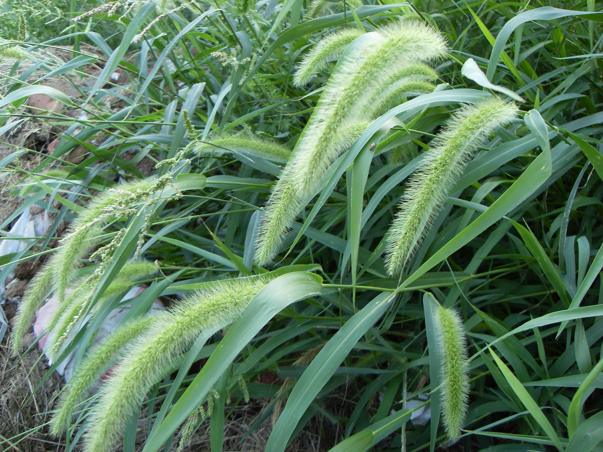

## 大狗尾草

---

**拉丁名:**  _Setaria faberii Herrm _

**科 属:** 禾本科 狗尾草属

**别 名:** 谷莠子
 【形  态】一年生草本。秆直立，较狗尾草坚硬而高大，高50
  ～120厘米，径达6毫米。叶鞘边缘常有细纤毛，余则无毛；叶
  舌退化为长1～2毫米的纤毛叶片长10～40厘米，宽5～15毫米，
  无毛或表面有刚毛。圆锥花序圆柱形，下垂，长5～15厘米；
  主轴有柔毛；小穗椭圆形，长约3毫米；刚毛通常绿色。花果
  期7～10月。
 【西大分布地】见于南校区各处。
 备注:
     2009年7月27日摄于西北大学南校区垃圾处理站附近。

**原产地:** 大狗尾草
详细资料： 首页 下一页 上一页
【拉丁名】Setaria faberii Herrm.
【科 属】禾本科 狗尾草属
【别 名】谷莠子
 【形 态】一年生草本。秆直立，较狗尾草坚硬而高大，高50
 ～120厘米，径达6毫米。叶鞘边缘常有细纤毛，余则无毛；叶
 舌退化为长1～2毫米的纤毛叶片长10～40厘米，宽5～15毫米，
 无毛或表面有刚毛。圆锥花序圆柱形，下垂，长5～15厘米；
 主轴有柔毛；小穗椭圆形，长约3毫米；刚毛通常绿色。花果
 期7～10月。
【西大分布地】见于南校区各处。
备注:
 2009年7月27日摄于西北大学南校区垃圾处理站附近。

**形  态:** 一年生草本。秆直立，较狗尾草坚硬而高大，高50～120厘米，径达6毫米。叶鞘边缘常有细纤毛，余则无毛；叶舌退化为长1～2毫米的纤毛叶片长10～40厘米，宽5～15毫米，无毛或表面有刚毛。圆锥花序圆柱形，下垂，长5～15厘米；主轴有柔毛；小穗椭圆形，长约3毫米；刚毛通常绿色。花果期7～10月。

**西大分布地:** 见于南校区各处。

**备注:** 大狗尾草详细资料：首页下一页上一页【拉丁名】SetariafaberiiHerrm.【科属】禾本科狗尾草属【别名】谷莠子【形态】一年生草本。秆直立，较狗尾草坚硬而高大，高50～120厘米，径达6毫米。叶鞘边缘常有细纤毛，余则无毛；叶舌退化为长1～2毫米的纤毛叶片长10～40厘米，宽5～15毫米，无毛或表面有刚毛。圆锥花序圆柱形，下垂，长5～15厘米；主轴有柔毛；小穗椭圆形，长约3毫米；刚毛通常绿色。花果期7～10月。【西大分布地】见于南校区各处。备注:2009年7月27日摄于西北大学南校区垃圾处理站附近。

.JPG) 

 

