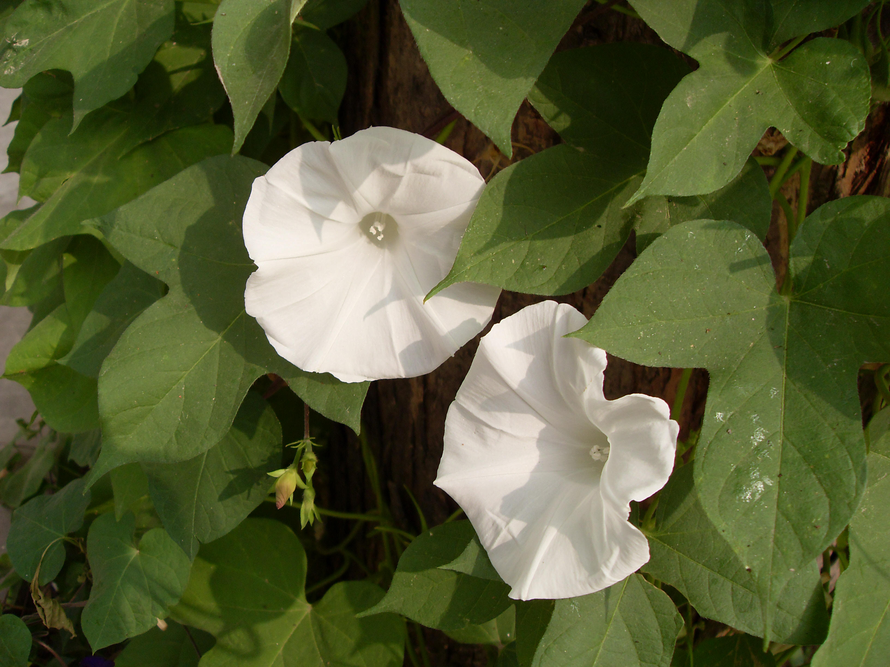

## 大花牵牛

---

**拉丁名:**  _Pharbitis nil choisy,Ipomoea nil Roth_

**科 属:** 旋花科 牵牛属

**别 名:** 日本牵牛

**原产地:** 亚、非洲热带

**形  态:** 一年生草本。茎缠绕，叶大，有长柄，叶身3裂。花1～3朵腋生，总梗短于叶柄，花径可达10厘米。此种为园艺品种，花色较多。蒴果近球形，3瓣裂，种子卵状三棱形，黑色被褐色绒毛。花期6～9月，果期7～10月。

**西大分布地:** 三校区偶见，多见于北校区西大花园。　

**备注:** 2008年9月22日摄于西北大学北校区西大花园。

 

