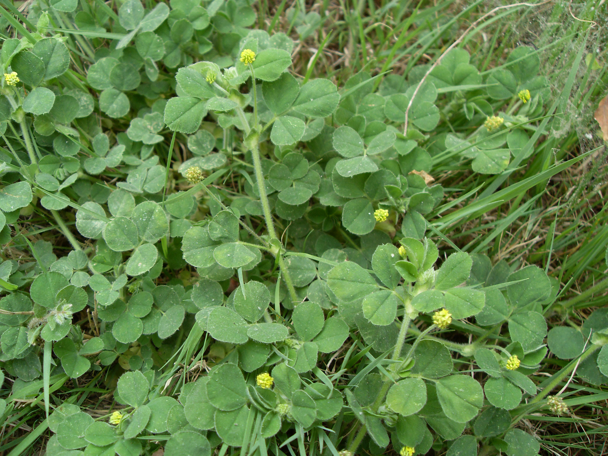

## 小苜蓿

---

**拉丁名:**  _Medicago minima (Linn.) Grufb_

**科 属:** 豆科 苜蓿属

**别 名:** Medicago minima (Linn.) Grufb.【科 属】豆科 苜蓿属

**原产地:** 中国

**形  态:** 一年生小草本。茎高5～30厘米，多分枝，平铺地上，多少有毛；主根发达。小叶3，倒卵形，长5～10毫米，两面有毛近段出有细齿；叶柄细，托叶卵形。头状花序具3～8朵花，总花梗细，腋生，比叶长。花冠淡黄色，蝶形。荚果球形，旋转3～5圈，脊棱上具数列长刺。种子肾形，花果期3～5月。

**西大分布地:** 常见杂草，见于三校区草坪中。

**备注:** 2009年4月17日摄于西北大学北校区化工学院后草丛。

.JPG) 

 

