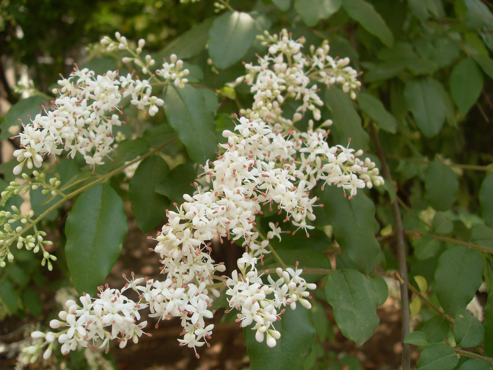
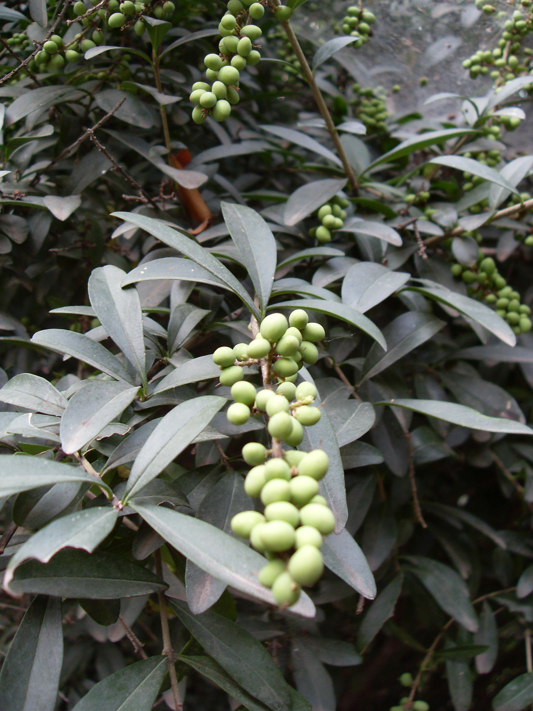

## 小蜡

---

**拉丁名:**  __

**科 属:** 木犀科 女贞属

**别 名:** 山紫甲树、山指甲、水黄杨

**原产地:** 中国南部

**形  态:** 半常绿灌木或小乔木，高2～7米；小枝密生短柔毛。叶薄革质，卵圆形长3～5厘米，端锐尖或钝，基部楔形或圆形，背面沿中脉有短柔毛。圆锥花序长4～10厘米，花轴有短柔毛；花白色，芳香，花梗细而明显，花冠裂片长于筒部，雄蕊超出花冠裂片。核果近圆形。花期4～5月。　　　　

**西大分布地:** 北校区见于六、七号教学楼东侧，行政楼南侧及六号宿舍南侧。 

**备注:** 上图为小蜡花枝，2009年5月5日摄于西北大学北校区六号教学楼南侧；左图为小蜡果实，2008年9月22日摄于西北大学北校区行政楼南侧。

 

 

