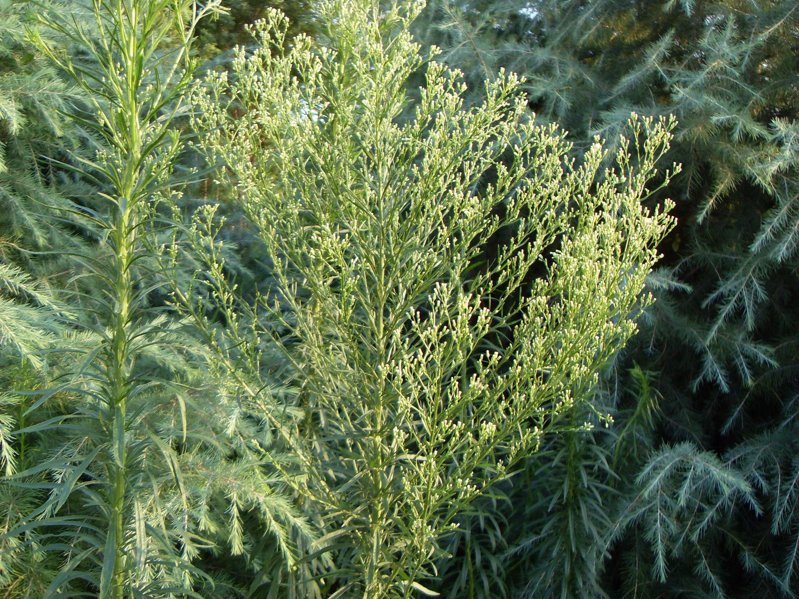

## 小飞蓬

---

**拉丁名:**  _Conyza canadensis (Linn.) Cronq_

**科 属:** 菊科 紫菀族 白酒草属

**别 名:** 小蓬草、小白酒菊

**原产地:** 不详

**形  态:** 一年生草本，高50～150厘米。茎直立，有细条纹及粗糙毛，上部多分枝。叶互生，线状披针形或长圆状线形，基部狭，无明显叶柄，先端尖全缘或带锯齿，边缘有长睫毛。头状花序多数，直径约5毫米，密集成圆锥状或伞房圆锥状；舌状花直立，白色略紫，线状至披针形；两性花筒状。瘦果长圆形，冠毛白色，后变黄褐色。花期6～10月。

**西大分布地:** 三校区常见杂草，见于各处。

**备注:** 2009年7月27日摄于西北大学南校区待开发区。

.JPG) 

 

