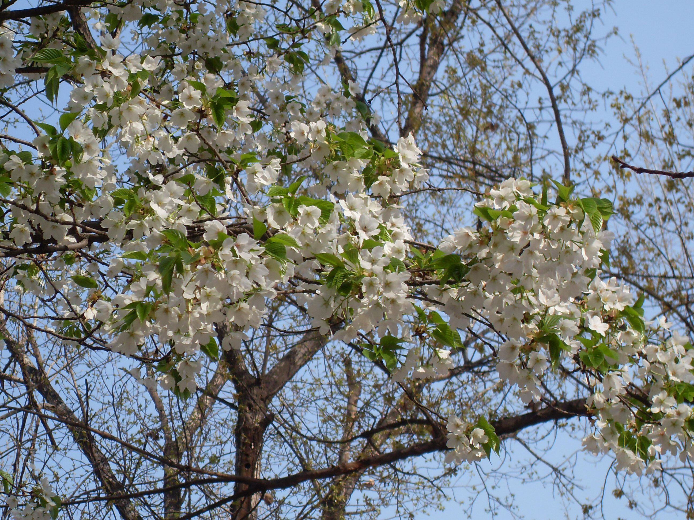
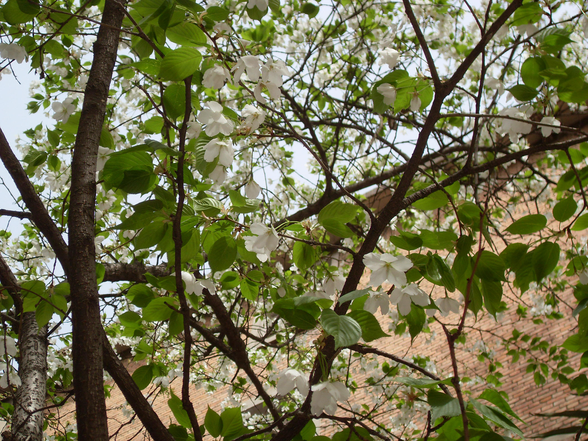

## 山樱花

---

**拉丁名:**  _Cerasus serrulata (Lindl.) G.Don_

**科 属:** 蔷薇科 樱属

**别 名:** 樱花

**原产地:** 中国

**形  态:** 落叶乔木，高3～10米。树皮光滑，灰色。叶椭圆状卵形或倒卵形，长4～9厘米，宽3～5厘米，边缘有带刺芒状单锯齿或重锯齿，齿间有小腺体；叶柄有1～3圆形腺体。花伞房状总状或近伞形花序，苞片褐色或淡绿褐色，边有腺齿；花直径2～3厘米，花瓣倒卵形，白色或粉色，先端下凹。核果球形，直径8～10毫米，紫黑色。花期4～5月，果期6～7月。

**西大分布地:** 仅见于北校区号宿舍西侧行道旁。

**备注:** 2009年3月22日摄于西北大学北校区号宿舍西侧行道旁。

 

 

