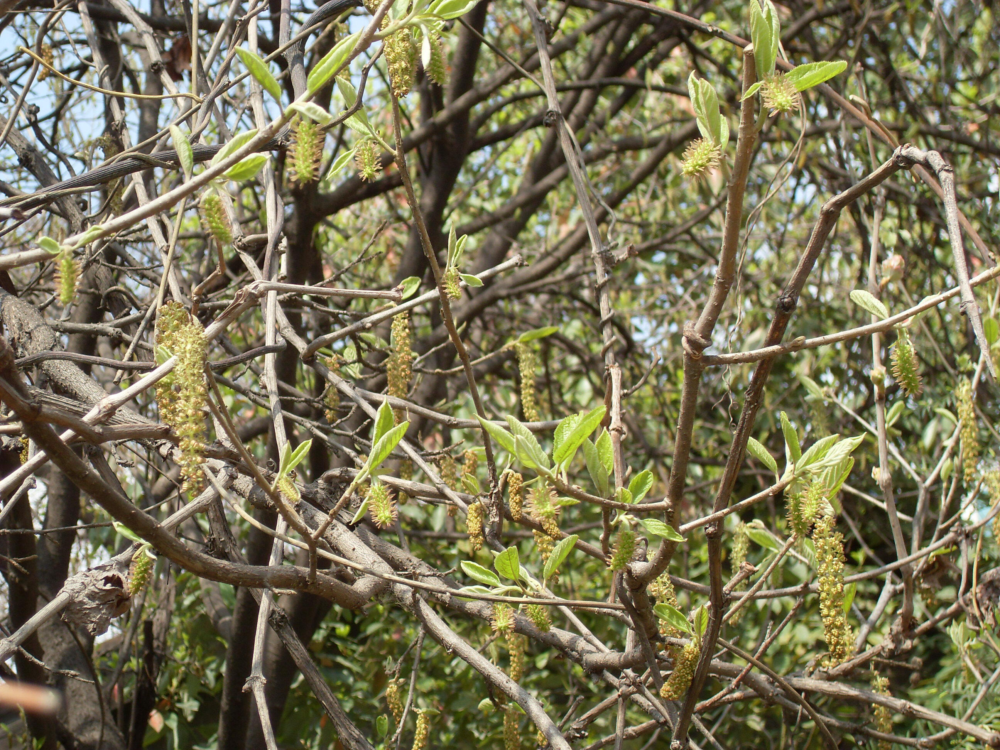

## 山白树

---

**拉丁名:**  _Sinowilsonia henryi Hemsl_

**科 属:** 金缕梅科 山白树属

**特 注:** 中国特有稀有树种

**别 名:** Sinowilsonia henryi Hemsl.
【科  属】金缕梅科  山白树属
【特  注】中国特有稀有树种

**原产地:** 中国湖北、陕西

**形  态:** 落叶小乔木，高达8米；小枝有星状毛。叶倒卵形或椭圆形，长10～18厘米，宽6～10厘米，顶端锐尖，基部圆形或浅心形，边缘有小锯齿，下面密生柔毛；叶柄长8～15毫米。花单性，雌雄同株，无花瓣；雄花排列成柔荑花序状，雌花组成总状花序长6厘米。果穗长达20厘米，有灰黄色毛；蒴果卵圆形，有毛，长1厘米；种子长8毫米，黑色，有光泽。

**西大分布地:** 仅见于北校区西大花园内。

**备注:** 2009年3月23日摄于西北大学北校区西大花园内。

 

