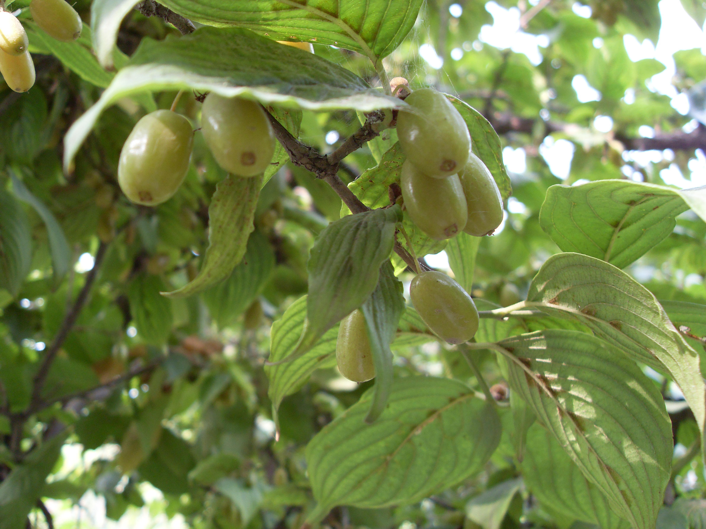

## 山茱萸

---

**拉丁名:**  _Macrocarpium officinale(s.etz.) Nakal_

**科 属:** 山茱萸科 山茱萸属

**别 名:** 药枣

**原产地:** 中国、日本、朝鲜

**形  态:** 落叶灌木或小乔木。叶对生，卵状椭圆形，长5～12厘米，叶端渐渐，叶基部浑圆或楔形，叶两面有毛，叶柄长约1厘米。伞形花序腋生，序下有4小总苞片；花瓣4，卵形，黄色。核果椭圆形，熟时红色。花期5～6月，果期8～10月。　　　　　　

**西大分布地:** 北校区西大花园内有三株。

**备注:** 上图为山茱萸花枝，2009年3月6日摄于西北大学北校区西大花园内，下图为山茱萸果实，2008年10月12日摄于西北大学北校区西大花园内。

 

 

