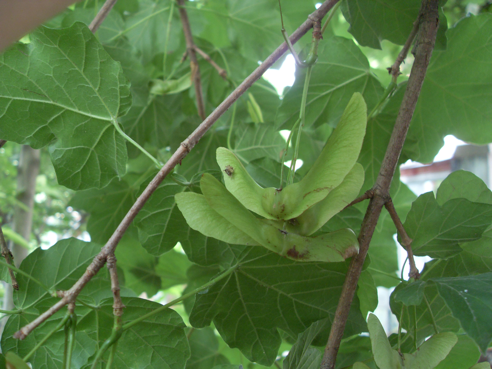
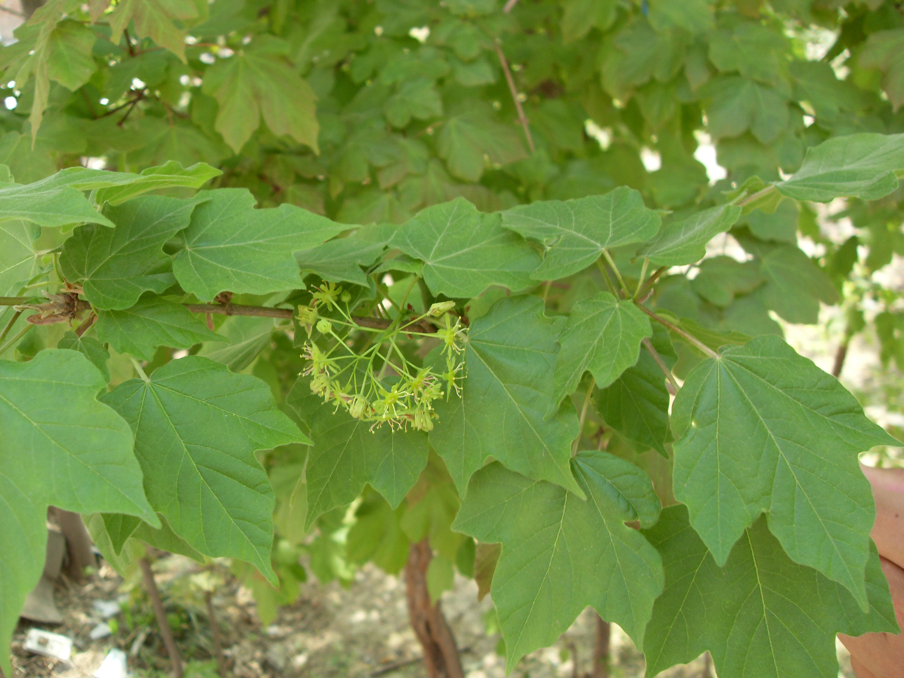

## 庙台槭

---

**拉丁名:**  _Acer miaotaiense P.C. Tsoong_

**科 属:** 槭树科 槭属

**特 注:** 中国秦巴山区特有种，三级保护植物

**别 名:** Acer miaotaiense P.C. Tsoong
【科  属】槭树科  槭属
【特  注】中国秦巴山区特有种，三级保护植物
【形  态】落叶大乔木，高达25米。树皮深灰色，稍粗糙，
 小枝近圆柱形，当年生枝褐紫色。单叶，纸质，阔卵形，
 长7～9厘米，宽6～8厘米，基部近心形，常3～5浅裂，边
 缘微成浅波状；基出掌状脉3～5条。伞房花序，无毛，翅
 果长3～3.5厘米，两翅水平张开，小坚果扁平，近圆形，密
 被黄色绒毛。花期4月，果期9月。
　
　
　
　
　
                                                                    【西大分布地】仅见于北校区西大花园内。
                                                                     备注：
                                                                        上图为庙台槭花枝，2009年4月7日摄于西北大学北校区西大花园内；
                                                                        左图为庙台槭翅果，2009年5月30日摄于西北大学北校区西大花园内。

**原产地:** 庙台槭
详细资料： 首页 下一页上一页
【拉丁名】Acer miaotaiense P.C. Tsoong
【科 属】槭树科 槭属
【特 注】中国秦巴山区特有种，三级保护植物

**形  态:** 落叶大乔木，高达25米。树皮深灰色，稍粗糙，小枝近圆柱形，当年生枝褐紫色。单叶，纸质，阔卵形，长7～9厘米，宽6～8厘米，基部近心形，常3～5浅裂，边缘微成浅波状；基出掌状脉3～5条。伞房花序，无毛，翅果长3～3.5厘米，两翅水平张开，小坚果扁平，近圆形，密被黄色绒毛。花期4月，果期9月。　　　　　

**西大分布地:** 仅见于北校区西大花园内。 

**备注:** 上图为庙台槭花枝，2009年4月7日摄于西北大学北校区西大花园内；左图为庙台槭翅果，2009年5月30日摄于西北大学北校区西大花园内。

 

 

