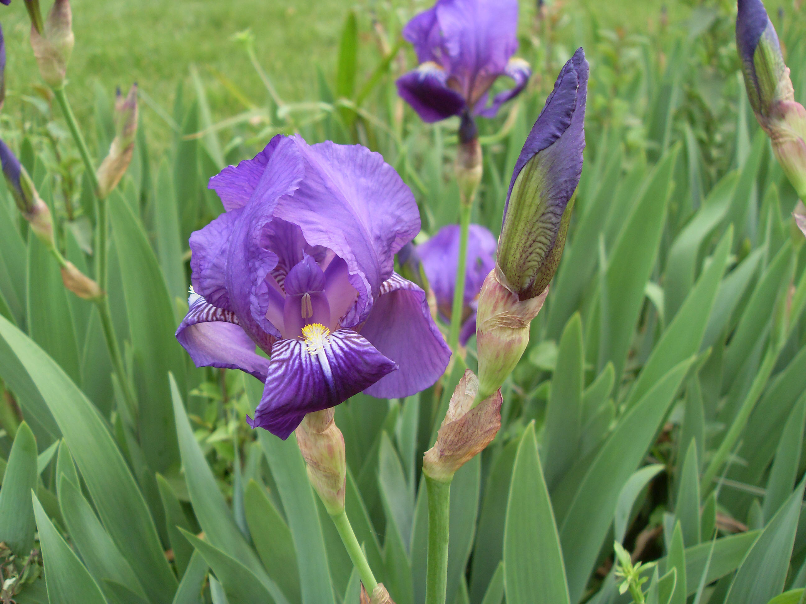

## 德国鸢尾

---

**拉丁名:**  _Lris germanica Linn_

**科 属:** 鸢尾科 鸢尾属

**别 名:** 爱丽丝

**原产地:** 欧洲中部及南部

**形  态:** 多年生宿根草本。根状茎肥厚，略成扁圆形，有横纹，黄褐色，基生叶剑形，长20-50厘米，宽2-4厘米，直立或稍弯曲，无明显的中脉，淡绿色或灰绿色，常具白粉，基部鞘状，常带红褐色，先端渐尖。花茎高60-100厘米，中下部有1-3枚茎生叶；花下具3枚苞片，革质，边缘膜质，卵圆形或宽卵形，长2-5厘米，宽2-3厘米，有1-2朵花，花大，鲜艳，直径可达12厘米，淡紫色、蓝紫色、深紫色或白色，有香味，花被管成喇叭形，长约2厘米，花被裂片6枚，2轮排列，外花被裂片椭圆形或倒卵形，反折，具条纹，爪部楔形，中脉上密生黄色须毛状附属物，内花被裂片圆形或倒卵形，直立，上部向内拱曲，爪部狭楔形，中脉宽而向外隆起；蒴果三棱状圆柱形，种子梨形，黄褐色，表面有皱纹。花期5-6月，果期7～8月。

**西大分布地:** 仅见于北校区科学楼南侧大草坪西侧林下。

**备注:** 2009年4月12日摄于西北大学北校区科学楼南侧大草坪西侧林下。　

.JPG) 

 

