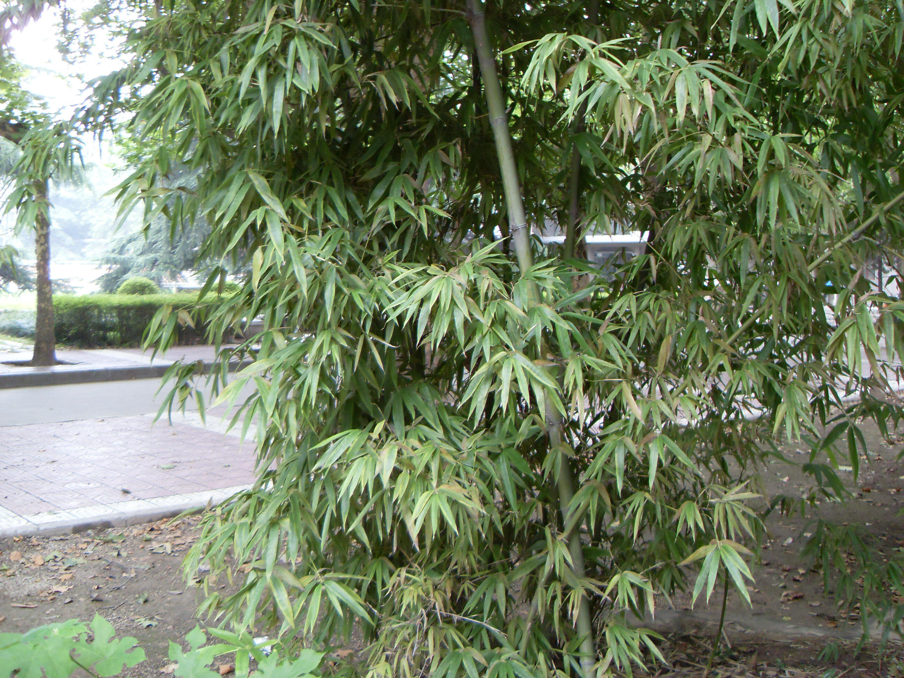

## 慈竹

---

**拉丁名:**  _Neosinocalamus affinis (Rendle) Keng f _

**科 属:** 禾本科 慈竹属

**别 名:** 茨竹、甜慈
 【原产地】中国
 【形  态】主干高5—10米，顶端细长，弧形，弯曲下垂如钓丝状，
  粗3—6厘米。节间长达60cm,贴生长2mm的灰褐色脱落性小刺毛，
  箨环明显，在秆基数节者其上下各有宽5—8mm的一圈紧贴白色绒
  毛。丝鞘革质，背部密集贴生棕黑色刺毛，先端稍呈山字形；箨
  耳不明显，狭小，呈皱折状，鞘口具长12mm细毛；箨舌高4—5mm,
  中央凸起成弓形，边缘具流苏状纤毛；箨叶直立或外翻，披针形，
  先端渐尖，基部收缩成圆形，腹面密被白色小刺毛，背面之中部
  亦疏生小刺毛。
 【西大分布地】仅见于北校区文博学院楼后西侧。
备注：
    2009年8月21日摄于西北大学北校区文博学院楼后西侧。

**原产地:** 中国
【形 态】主干高5—10米，顶端细长，弧形，弯曲下垂如钓丝状，
 粗3—6厘米。节间长达60cm,贴生长2mm的灰褐色脱落性小刺毛，
 箨环明显，在秆基数节者其上下各有宽5—8mm的一圈紧贴白色绒
 毛。丝鞘革质，背部密集贴生棕黑色刺毛，先端稍呈山字形；箨
 耳不明显，狭小，呈皱折状，鞘口具长12mm细毛；箨舌高4—5mm,
 中央凸起成弓形，边缘具流苏状纤毛；箨叶直立或外翻，披针形，
 先端渐尖，基部收缩成圆形，腹面密被白色小刺毛，背面之中部
 亦疏生小刺毛。
【西大分布地】仅见于北校区文博学院楼后西侧。
备注：
 2009年8月21日摄于西北大学北校区文博学院楼后西侧。

**形  态:** 主干高5—10米，顶端细长，弧形，弯曲下垂如钓丝状，粗3—6厘米。节间长达60cm,贴生长2mm的灰褐色脱落性小刺毛，箨环明显，在秆基数节者其上下各有宽5—8mm的一圈紧贴白色绒毛。丝鞘革质，背部密集贴生棕黑色刺毛，先端稍呈山字形；箨耳不明显，狭小，呈皱折状，鞘口具长12mm细毛；箨舌高4—5mm,中央凸起成弓形，边缘具流苏状纤毛；箨叶直立或外翻，披针形，先端渐尖，基部收缩成圆形，腹面密被白色小刺毛，背面之中部亦疏生小刺毛。

**西大分布地:** 仅见于北校区文博学院楼后西侧。

**备注:** 2009年8月21日摄于西北大学北校区文博学院楼后西侧。

 

