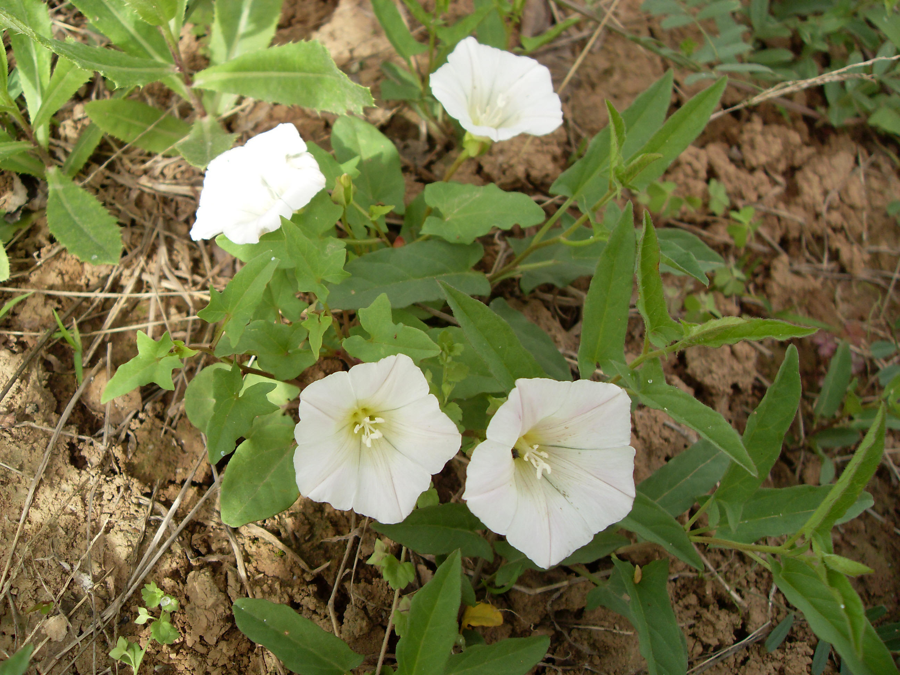

## 打碗花

---

**拉丁名:**  _Calystegia hederacea Wall_

**科 属:** 旋花科 打碗花属

**别 名:** 小旋花、兔儿草
【形  态】多年生草质藤本。主根较粗长，横走。茎细弱，长0.5
 ～2米，匍匐或攀援。叶互生，叶片三角状戟形或三角状卵形，侧
 裂片展开，常再2裂。花萼外有2片大苞片，卵圆形；花蕾幼  时完
 全包藏于内。萼片5，宿存。花冠漏斗形（喇叭状），粉红色或白色，
 口近圆形微呈五角形。与同科其它常见种相比花较小，喉部近白色。
 蒴果卵圆形，光滑种子卵圆形，黑褐色。
【西大分布地】常见杂草，见于三校区各处。
备注：
    2009年4月24日摄于西北大学南校区北门口东侧。
  
　

**原产地:** 打碗花
详细资料： 首页 下一页 上一页 
【拉丁名】Calystegia hederacea Wall.
【科 属】旋花科 打碗花属
【别 名】小旋花、兔儿草

**形  态:** 多年生草质藤本。主根较粗长，横走。茎细弱，长0.5～2米，匍匐或攀援。叶互生，叶片三角状戟形或三角状卵形，侧裂片展开，常再2裂。花萼外有2片大苞片，卵圆形；花蕾幼时完全包藏于内。萼片5，宿存。花冠漏斗形（喇叭状），粉红色或白色，口近圆形微呈五角形。与同科其它常见种相比花较小，喉部近白色。蒴果卵圆形，光滑种子卵圆形，黑褐色。

**西大分布地:** 常见杂草，见于三校区各处。

**备注:** 2009年4月24日摄于西北大学南校区北门口东侧。　

.JPG) 

 

