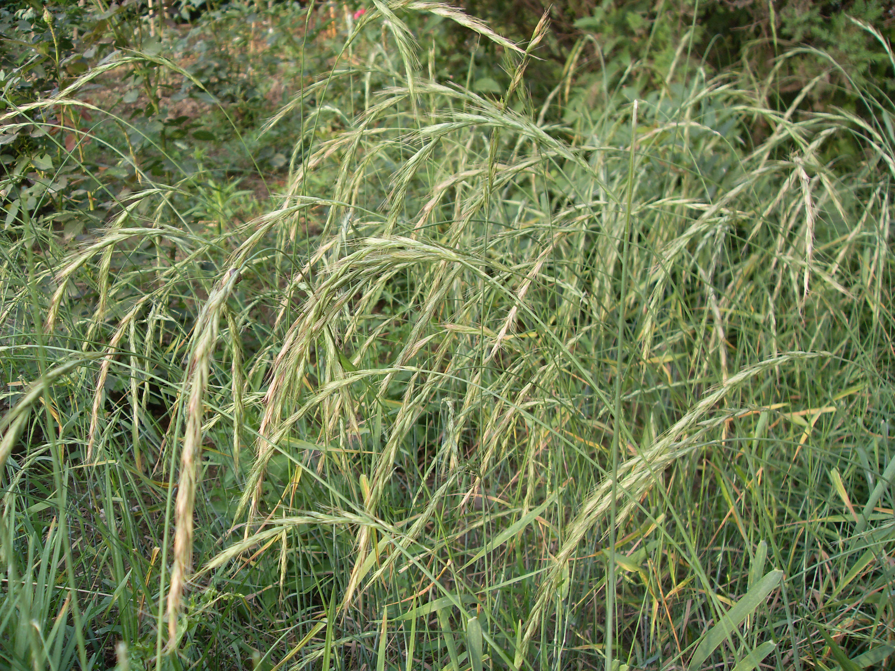

## 披碱草

---

**拉丁名:**  _Elymus dahuricus Turcz _

**科 属:** 禾本科 披碱草属

**别 名:** 老麦芒
 【形  态】多年生草本，疏丛型，须根状，根深可达100厘米。
  秆直立，高70—160厘米。叶片长8—32厘米，宽0.5—1.4厘米
  ，叶缘被疏纤毛。穗状花序直立，一般具有23—28个穗节，
  穗轴中部各节具2枚小穗，而接近顶端及基部的仅具1枚，小
  穗含3—6个小花，二颖几等长，披针形；外稃背部被密短毛，
  芒长1.2—2.8厘米；内稃脊被纤毛。颖果长椭圆形，长约6毫米
  ，顶端钝圆，具淡黄色茸毛。
 【西大分布地】常见杂草，见于各处。
 备注：
     2009年6月2日摄于西北大学北校区图书馆前。

**原产地:** 披碱草
详细资料： 首页 下一页上一页
【拉丁名】Elymus dahuricus Turcz.
【科 属】禾本科 披碱草属
【别 名】老麦芒
【形 态】多年生草本，疏丛型，须根状，根深可达100厘米。
 秆直立，高70—160厘米。叶片长8—32厘米，宽0.5—1.4厘米
 ，叶缘被疏纤毛。穗状花序直立，一般具有23—28个穗节，
 穗轴中部各节具2枚小穗，而接近顶端及基部的仅具1枚，小
 穗含3—6个小花，二颖几等长，披针形；外稃背部被密短毛，
 芒长1.2—2.8厘米；内稃脊被纤毛。颖果长椭圆形，长约6毫米
 ，顶端钝圆，具淡黄色茸毛。
【西大分布地】常见杂草，见于各处。
备注：
 2009年6月2日摄于西北大学北校区图书馆前。

**形  态:** 多年生草本，疏丛型，须根状，根深可达100厘米。秆直立，高70—160厘米。叶片长8—32厘米，宽0.5—1.4厘米，叶缘被疏纤毛。穗状花序直立，一般具有23—28个穗节，穗轴中部各节具2枚小穗，而接近顶端及基部的仅具1枚，小穗含3—6个小花，二颖几等长，披针形；外稃背部被密短毛，芒长1.2—2.8厘米；内稃脊被纤毛。颖果长椭圆形，长约6毫米，顶端钝圆，具淡黄色茸毛。

**西大分布地:** 常见杂草，见于各处。

**备注:** 2009年6月2日摄于西北大学北校区图书馆前。

.JPG) 

 

