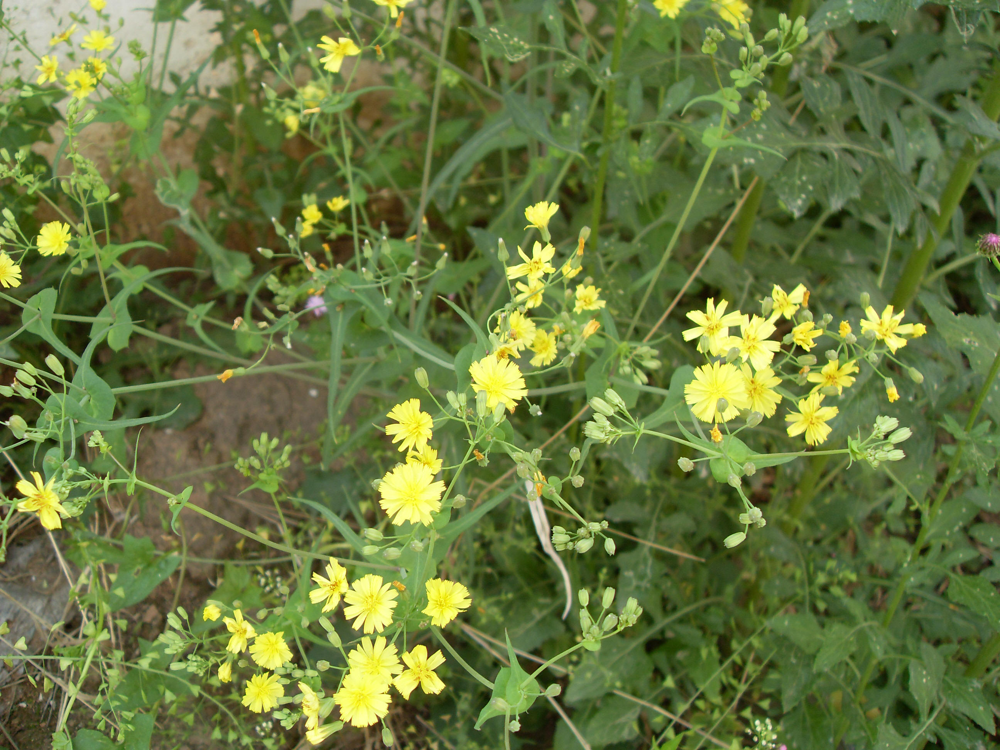

## 抱茎小苦荬

---

**拉丁名:**  _Ixeridium sonchifolium (Maxim.) Shih _

**科 属:** 菊科 小苦荬属

**别 名:** 抱茎苦荬菜
【形  态】多年生草本，株高约30～80厘米，无毛。茎直立，上部
 有分枝。基生叶多数，长3.5～8厘米，宽l～2厘米，顶端锐尖或圆钝
 ，基部下延成柄，边缘具锯齿或不整齐的羽状深裂，茎生叶较小
 ，卵状矩圆形或卵状披针形，长2.5～6厘米，宽0.7～1.5厘米，
 先端锐尖，基部常成耳形或戟状抱茎，全缘或羽状分裂，头状花
 序密集成伞房状，有细梗；头状花序只含舌状花，黄色，长7一8
 毫米，先端截形，具5齿。瘦果纺锤形，黑色。花果期4～7月。
 【西大分布地】仅见于南校区个别草丛中。
备注：
    2009年4月24日摄于西北大学南校区宿舍区草丛中。

**原产地:** 抱茎小苦荬
详细资料： 首页 下一页 上一页
【拉丁名】Ixeridium sonchifolium (Maxim.) Shih 
【科 属】菊科 小苦荬属
【别 名】抱茎苦荬菜

**形  态:** 多年生草本，株高约30～80厘米，无毛。茎直立，上部有分枝。基生叶多数，长3.5～8厘米，宽l～2厘米，顶端锐尖或圆钝，基部下延成柄，边缘具锯齿或不整齐的羽状深裂，茎生叶较小，卵状矩圆形或卵状披针形，长2.5～6厘米，宽0.7～1.5厘米，先端锐尖，基部常成耳形或戟状抱茎，全缘或羽状分裂，头状花序密集成伞房状，有细梗；头状花序只含舌状花，黄色，长7一8毫米，先端截形，具5齿。瘦果纺锤形，黑色。花果期4～7月。

**西大分布地:** 仅见于南校区个别草丛中。

**备注:** 2009年4月24日摄于西北大学南校区宿舍区草丛中。

.JPG) 

 

